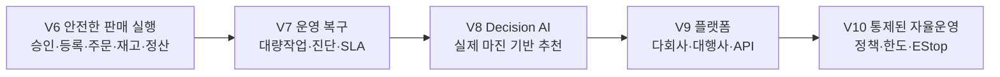

# HOMEZ V6 CTO 및 사업 전략 보고서

작성 기준일: 2026-08-05  
문서 성격: 제품 전략, 개발 우선순위, 시장 진입, 위험 통제, 수익성 시나리오  
판정 기준: 코드가 존재하는 것과 실제 운영 준비가 끝난 것을 구분한다.

## 읽기 안내

- **경영 판단**: 1, 6~9, 12, 17, 23~24
- **현재 개발 위치**: 2, 5, 10, 14, 28, 33~35
- **시장·판매**: 3~4, 8, 16, 29, 36~37
- **AI·승인·이미지**: 19~20, 22, 25
- **보안·법무·배포**: 9, 18, 21, 30~32
- **90일 실행**: 14~18, 26~27

## 1. 경영진 요약

HOMEZ가 이길 수 있는 자리는 단순한 쇼핑몰 통합관리나 AI 문구 생성기가 아니다.
무료 통합관리 제품과 저가 AI 등록 도구가 이미 존재하고, 성숙한 통합관리 제품은
주문·재고·정산·다계정 운영을 월 10만 원대 이상에 제공한다. HOMEZ의 권장 포지션은
다음과 같다.

> 판매 후보의 수익성을 판단하고, AI가 초안과 이미지를 만들며, 사용자의 승인 아래
> 여러 채널에 안전하게 등록하고, 이후 주문·재고·가격·정산까지 같은 증거 사슬로
> 관리하는 Profit-Safe AI Commerce OS

권장 시장 진입 순서는 다음과 같다.

1. 기존에 쿠팡과 네이버에서 판매 중인 2~10인 셀러 팀 5곳을 설계 파트너로 확보한다.
2. 신상품 발굴보다 기존 상품 1건을 안전하게 복제·등록·동기화하는 E2E를 먼저 완성한다.
3. 판매자의 시간 절감, 등록 성공률, 재고 오류, 실제 마진을 측정한다.
4. 월 49,000원·119,000원·249,000원의 3단계 구독을 가격 실험한다.
5. 네이버 커머스솔루션마켓은 검증 후 두 번째 유통 채널로 사용한다.
6. 주문·재고·정산의 신뢰성이 확보되기 전에는 완전자동 상품 운영을 판매하지 않는다.

12개월 기본 시나리오는 유료 고객 250개사, 월평균매출 107,000원, MRR 약
2,675만 원이다. 가정한 변동원가와 고정비 아래에서는 월 손익분기점이 약 220~300개사다.
이 수치는 전망이 아니라 가격과 원가를 검증하기 위한 경영 가정이며, 5개 설계 파트너의
실측 데이터로 매월 갱신해야 한다.

**투자 판정: `PROCEED_CONDITIONALLY`.** 현재 V6의 공개 출시는 승인하지 않지만,
Listing Reliability 유료 검증을 위한 90일 투자는 권장한다. 월 고정비 1,200만~1,800만 원
가정에서 90일 현금투입 상한은 약 3,600만~5,400만 원(외부 법무·보안·예비비 별도)으로
두고, 5개 설계 파트너 중 3개사의 유료 의향과 실상품 E2E 통과가 없으면 Full Commerce OS
확장을 멈춘다.

## 2. 현재 제품의 사실상 위치

현재 Ledger 기준:

- Gate 0: 완료
- Gate 1: 코드 완료, 실제 관리자 비밀번호 변경과 출처 불명 코드 폐기 Live Gate 대기
- Gate 2: StoreConnection 완료
- Gate 3: AI 상품 초안·이미지 핵심 기반 존재, 공백 보완 필요
- Gate 4: 다채널 등록 기반 존재, 플랫폼 상태 동기화 백엔드가 추가됐으나 실제 DB Migration,
  UI·payload preview·retry·CSV 보안 등 마무리 필요
- Gate 5: 실상품 E2E 준비 미완료
- Gate 6: 주문·재고·가격·정산의 실동기화는 대부분 미완료
- Gate 7: 운영 UI 부분 구현
- Gate 8: 설치·업데이트·복구 부분 구현
- Gate 9: 출시 독립 감사 미착수

최근 보고된 전체 회귀는 1,017개 통과다. 이는 코드 회귀의 강한 증거지만 실제
Credential, 실제 외부 API, 실제 상품, 설치·복원, 장시간 운영을 증명하지는 않는다.
따라서 현재 판정은 `V6_BLOCKED`가 맞다.

2026-08-05 현재 `git status`는 이번 보고서 1개를 포함해 244개 변경 항목(수정 26,
삭제 21, untracked 197)을 보인다. 기존 WIP 243개를 보호해 온 결과지만, 이 상태 자체는
출시 소스의 재현성을 보장하지 않는다. 외부 파일럿 전에는 항목별 소유·목적을 분류하고,
원자적 커밋과 clean clone 전체 테스트·패키징을 거쳐 Release 태그를 만들어야 한다.
대량 커밋이나 기존 WIP 폐기는 별도 검토 없이 실행하지 않는다.

2026-08-05 읽기 전용 파일 대조에서도 Gate 6 판단은 유지됐다. `order`, `inventory`,
`settlement` 도메인과 내부 CRUD는 존재하지만 해당 도메인에 채널 Provider·증분 커서·
webhook 기반 실동기화가 없고 독립 `pricing` 도메인은 없다. Gate 8은 Migration Runner의
적용 전 SQLite 백업 생성·무결성 확인은 존재하지만 사용자 복원 워크플로, 배포 서명,
업데이트 staging·rollback은 별도 완성이 필요하다. 기존 레거시 marketplace 클라이언트가
있다는 사실을 V6 운영 동기화 완료 증거로 간주하지 않는다.

### SWOT 요약

| 강점 | 약점 |
|---|---|
| 광범위한 회귀 테스트, company 격리, idempotency, 승인·EStop 설계 | 실 Credential·실상품·장시간 운영 증거 부족 |
| AI 초안·이미지와 등록·상태 원장을 연결할 코드 자산 | Gate 6 실동기화와 Gate 8 배포·복원 미완료 |
| Desktop 로컬 보안 저장소로 Secret 통제 가능 | 설치·업데이트·원격지원 비용, Windows 의존 |

| 기회 | 위협 |
|---|---|
| 대규모 온라인 판매시장과 네이버 솔루션 유통 | 무료·저가 통합관리와 AI 등록 도구 |
| AI 생성과 등록 후 복구·실제 마진 사이의 제품 공백 | 채널 API·약관·수수료 변경 |
| 기존 셀러의 엑셀·판매자센터 반복업무 | 보안사고·오등록·규제·저작권 책임 |

## 3. 시장 근거

### 3.1 시장은 충분히 크다

국가데이터처의 최신 연간 자료에 따르면 2025년 국내 온라인쇼핑 거래액은
272조 398억 원으로 전년보다 4.9% 증가했고, 모바일쇼핑 거래액은 211조 1,448억 원으로
6.5% 증가했다. 2025년 12월 한 달 거래액은 24조 2,904억 원, 모바일 비중은 77.4%였다.
시장 자체의 부족보다 판매 운영의 복잡성과 경쟁이 문제다.

- [국가데이터처 2025년 12월 및 연간 온라인쇼핑동향](https://sri.kostat.go.kr/boardDownload.es?bid=241&list_no=443337&seq=1)

네이버는 커머스솔루션마켓의 잠재 고객을 90만 스마트스토어 판매자로 설명하며,
구독·결제·정산과 솔루션 소개 채널을 제공한다. HOMEZ가 네이버 심사를 통과할 경우
직접 PG를 처음부터 만들지 않고 판매자에게 도달할 수 있는 유통 경로가 된다.

- [네이버 커머스솔루션마켓 소개](https://apicenter.commerce.naver.com/docs/solution-doc/1000/%EC%BB%A4%EB%A8%B8%EC%8A%A4%EC%86%94%EB%A3%A8%EC%85%98%EB%A7%88%EC%BC%93-%EC%86%8C%EA%B0%9C)
- [네이버 비즈월렛 결제 안내](https://apicenter.commerce.naver.com/docs/solution-doc/3000/%EC%86%94%EB%A3%A8%EC%85%98-%EA%B2%B0%EC%A0%9C-%EC%88%98%EB%8B%A8-%EB%B9%84%EC%A6%88%EC%9B%94%EB%A0%9B)

### 3.2 가격 경쟁은 이미 치열하다

2026년 8월 확인 기준 플레이오토의 공개 STANDARD 요금은 월 128,040원(VAT 별도)이며,
월 주문 3,000건, 쇼핑몰 ID 10개, 사용자 5명, AI 크레딧 2,400을 포함한다.
반면 사방넷 미니는 무료 진입을 내세운다. 네이버 커머스솔루션마켓의 AI 상품 등록
도구는 무료부터 4,900원·11,900원·24,900원·49,000원까지 존재한다.

- [플레이오토 이용요금](https://www.plto.com/introduction/Charge/)
- [사방넷 미니](https://sbadmin01.sbmini.co.kr/)
- [네이버 커머스솔루션마켓 AI 등록 솔루션 사례](https://solution.smartstore.naver.com/ko/solution/SOL_5gy2dBEStkbaQXlI1FqJ4r)

결론은 명확하다. HOMEZ가 상품명 생성이나 주문수집만 판매하면 무료·저가 제품과
직접 경쟁한다. 가격을 방어하려면 다음의 결합가치를 증명해야 한다.

- 채널별 필수정보 오류 감소
- 승인 전 마진과 위험 확인
- 등록 후 상태 추적과 실패 복구
- 주문·재고·정산의 동일 원장 연결
- Credential과 회사 데이터의 안전한 격리
- 감사 가능한 AI 자동화

| 제품군 | 강점 | 약점·빈틈 | HOMEZ 대응 |
|---|---|---|---|
| 무료·경량 통합관리 | 진입비용 낮음 | 고급 복구·수익 판단 제한 | 가격경쟁 회피 |
| 성숙 통합관리 | 주문·재고·다계정 | 학습비용·복잡성·AI 연결 공백 | 더 좁고 쉬운 업무 완결 |
| AI 등록 도구 | 초안·이미지 생성 빠름 | 등록 이후 상태·주문·정산 단절 | 승인부터 운영 원장까지 연결 |
| HOMEZ 목표 | 수익 판단+안전 실행+복구 | 아직 실 E2E·운영 신뢰 미증명 | 5개 파일럿으로 증명 |

### 3.3 채널 연동은 지속 유지비가 든다

쿠팡은 기본적으로 vendorId당 초당 5회를 넘는 호출에 429를 적용할 수 있고,
기준은 변경될 수 있다고 안내한다. 상품 생성에는 출고지·반품지·카테고리·고시정보·
옵션 등 많은 필드가 필요하며, 승인 이후 가격과 재고는 별도 API를 사용한다.

- [쿠팡 Open API 호출 제한](https://developers.coupangcorp.com/hc/en-us/articles/20414599556889-Introduction-of-Open-API-rate-limit-policy)
- [쿠팡 상품 생성](https://developers.coupangcorp.com/hc/ko/articles/360033877853-%EC%83%81%ED%92%88-%EC%83%9D%EC%84%B1)
- [쿠팡 상품 조회와 상태](https://developers.coupangcorp.com/hc/ko/articles/360033644994-%EC%83%81%ED%92%88-%EC%A1%B0%ED%9A%8C)
- [쿠팡 승인 후 가격·재고 변경 안내](https://developers.coupangcorp.com/hc/ko/articles/360022938354-%EA%B0%80%EA%B2%A9%EA%B3%BC-%EC%9E%AC%EA%B3%A0%EA%B0%80-%EB%B3%80%EA%B2%BD%EB%90%98%EC%A7%80-%EC%95%8A%EC%8A%B5%EB%8B%88%EB%8B%A4)

네이버 커머스API는 OAuth2 Client Credentials를 사용하지만 토큰 발급 시
client_id, timestamp, client_secret 기반 bcrypt 전자서명을 요구한다. 401 GW.AUTHN에는
토큰 재발급 fallback이 필요하고, 429와 5xx를 구분해야 한다.

- [네이버 커머스API 인증](https://apicenter.commerce.naver.com/docs/auth)
- [네이버 REST API 및 오류 규격](https://apicenter.commerce.naver.com/docs/restful-api)

따라서 Provider adapter, rate limit, retry, Trace ID, 상태 정규화는 일회성 개발이 아니라
지속적인 제품 원가다.

### 3.4 TAM·SAM·SOM 해석

- **TAM 참고치**: 국내 온라인쇼핑 거래액과 네이버가 밝힌 90만 판매자 도달 범위
- **SAM**: 쿠팡·네이버를 실제 중복 운영하고, 2~10인 팀·월 주문 300~5,000건이며,
  Windows Desktop과 API 연결을 수용하는 판매자
- **12개월 SOM 가설**: 80개사 보수, 250개사 공격적 기본, 600개사 고성장

90만 판매자 전체에 구독료를 곱해 시장규모라고 주장하지 않는다. 휴면·초보·단일채널·
저주문 판매자와 규제 고위험 업종을 제외하면 SAM은 크게 줄어든다. 설계 파트너 모집과
후보 100곳 조사를 통해 중복채널 비중, 주문 구간, 현재 도구 비용, 지불의향을 측정한 뒤
상향식 시장규모를 만든다. 현재 250개사 목표는 검증된 시장점유율이 아니라 실행 가설이다.

## 4. 권장 고객과 문제 선택

### 4.1 첫 고객

가장 적합한 초기 고객:

- 쿠팡과 네이버 두 채널을 이미 운영
- 월 주문 300~5,000건
- 직원 2~10명
- SKU 100~5,000개
- 상품 등록과 가격·재고·정산을 엑셀과 판매자센터로 병행
- 기존 통합관리 제품의 복잡성 또는 AI 기능 부족에 불만
- 운영 오류 1건의 비용이 월 구독료보다 큰 판매자

초기에는 피할 고객:

- 아직 판매 상품과 사업자 자격이 없는 완전 초보
- 식품·건강기능식품·의료·화장품·유아·전기제품처럼 규제 확인이 핵심인 신규 셀러
- 하루 수십만 주문을 처리하는 엔터프라이즈
- 무검토 완전자동 위탁판매를 요구하는 고객

첫 파일럿은 규제 위험이 비교적 낮고 기존에 합법적으로 판매 중인 생활·문구·취미
상품을 대상으로 한다. HOMEZ가 상품의 합법성이나 인증을 대신 보증해서는 안 된다.

2025년 공식 온라인쇼핑 통계에서 사무·문구 거래액은 약 2.13조 원, 생활용품은 약
19.83조 원, 애완용품은 약 2.95조 원이었다. 이는 시장 참고치일 뿐 규제 안전성 증거가
아니다. 초기에는 비전기·비식품·비의료 사무문구와 단순 생활 액세서리를 우선하고,
아동용·전기·화학·효능표현·신체접촉 제품은 증빙과 전문가 검토 없이 포함하지 않는다.

- [국가데이터처 2025년 상품군별 연간 온라인쇼핑 거래액](https://sri.kostat.go.kr/boardDownload.es?bid=241&list_no=443337&seq=1)

### 4.2 핵심 문제

초기 판매 메시지는 AI가 아니라 다음 세 문장으로 정리한다.

1. 한 상품을 쿠팡과 네이버 규격에 맞게 더 빠르게 등록한다.
2. 등록 전에 마진·필수정보·위험을 확인해 오등록을 줄인다.
3. 등록 후 상태·실패·재고·정산 차이를 한 화면에서 복구한다.

판매자는 직접 키워드를 입력해 후보를 검색·저장·제외할 수 있어야 한다. 후보에는 출처,
수집시각, 공급가·배송비·최소주문수량, 이미지 사용권, 수익 가정과 불확실성을 함께 둔다.
공식 API·계약된 데이터 소스를 우선하고, 약관을 위반하는 scraping으로 후보 수를 부풀리지
않는다. 오래된 가격·재고는 승인 전에 새로 확인한다.

## 5. 제품 우선순위

### P0: 보안 사고 종료

- 실제 관리자 비밀번호 변경
- 기존 세션 폐기
- 출처 불명 초대·복구 코드 폐기
- 회사명 민감정보 정정과 잔존 데이터 처리

이 항목이 끝나기 전에는 외부 고객 데이터를 받지 않는다.

### P1: 실제 상품 1건의 안전한 왕복

- 실제 Credential 입력
- 채널 연결 확인
- 기존 합법 상품 1건 가져오기 또는 사용자 입력
- payload preview
- dry-run
- 사용자 승인
- 쿠팡 또는 네이버 한 채널 등록
- 상태 동기화
- 실패 시 판매중지 또는 정리 절차

AI 이미지보다 먼저 이 흐름을 검증한다. 매출은 생성 기능이 아니라 성공적인 업무
완료에서 발생한다.

### P2: 두 채널과 부분 실패 복구

- 쿠팡·네이버 동시 등록
- 채널별 독립 결과
- retry와 idempotency
- CSV와 감사 이력
- 상태 동기화 UI

### P3: 주문·재고

- 주문 증분수집
- 안전재고와 예약재고
- overselling 방지
- 취소·반품 상태

주문 증분수집은 마지막 시각 하나로 구현하지 않는다. 네이버 변경 주문 API는 범위당 최대
300건을 제공하고 `moreFrom`·`moreSequence`로 다음 페이지를 이어 읽도록 한다. 채널별
복합 커서, 짧은 겹침 재조회, 주문·이벤트 idempotency, 원본 snapshot, 개인정보 최소화를
완료 조건으로 둔다.

- [네이버 변경 상품 주문 내역 조회](https://apicenter.commerce.naver.com/docs/commerce-api/2.52.1/seller-get-last-changed-status-pay-order-seller)

### P4: 실제 수익 원장

- 채널 수수료·배송비·광고비·환불
- 예상 정산과 확정 정산
- 상품·주문 단위 기여이익
- 정산 차이 대사

기본 계산식:

`주문 기여이익 = 실수취 매출 - 공급원가 - 채널·결제 수수료 - 물류·배송비 - 광고 귀속액
- 쿠폰·프로모션 부담 - 반품·파손 충당 - 주문당 변동 운영비`

부가세 포함·별도 처리는 사업자 세무정책에 맞춰 원장 전체에서 일관되게 적용하고 전문가와
검토한다. 예상 단계에서는 반품률·광고비·배송비를 보수/기준/낙관 범위로 표시하며,
정산 확정 뒤 예상 오차를 학습 데이터로 남긴다. 매출·마진·현금흐름을 서로 바꾸어 쓰지 않는다.

### P5: 제한된 AI 자동화

- 텍스트·이미지 Provider
- 비용 한도
- 근거와 신뢰도
- RECOMMEND_ONLY 기본
- AUTO는 가격·마진·재고·작업 수 한도 내에서만

Decision AI의 후보 순위는 예상 매출만 최적화하지 않는다. `예상 주문 기여이익 × 수요
신뢰도 - 재고자금 비용 - 반품·규제·공급 불확실성 패널티`를 설명 가능한 구성요소로
보여준다. 기여이익이 음수거나 필수 근거가 없으면 점수와 무관하게 차단한다.

## 6. 수익모델

### 6.1 권장 요금제 가설

| 요금제 | 월 가격 가설 | 대상 | 포함 범위 예시 |
|---|---:|---|---|
| Pilot | 환불조건부 도입비 | 설계 파트너 | 14일, 1개 스토어, 성공기준·지원 포함 |
| Solo | 49,000원 | 1인·초기 팀 | 채널계정 2, 주문 500, AI 패키지 20 |
| Growth | 119,000원 | 성장 셀러 | 채널계정 5, 주문 3,000, 사용자 3, AI 패키지 100 |
| Pro | 249,000원 | 전문 운영팀 | 채널계정 10, 주문 10,000, 사용자 10, AI 패키지 300 |
| Enterprise | 별도 견적 | 대행사·브랜드 | SLA, 전용 onboarding, API, 다회사 |

영구 무료 요금제는 권장하지 않는다. 무료 통합관리 경쟁자와 가격 경쟁을 만들고
지원비를 회수하기 어렵다. 대신 다음을 사용한다.

- 반복성이 확인된 뒤 공개하는 14일 제한 체험
- 조회 전용 진단판
- 첫 실제 등록 성공 시 유료 전환
- 연간 결제 10~15% 할인

### 6.2 부가매출

- 초기 데이터 이전·설정: 30만~150만 원
- 직원 교육·운영 설계: 30만~100만 원
- 추가 AI 크레딧: 실제 원가에 30~50% 운영 마진
- 추가 채널계정·사용자·주문량
- 정산 대사·Profit Guard 고급 리포트
- 대행사 다회사 관리

AI를 무제한으로 묶지 않는다. 공식 이미지 API 사례에서 생성 비용은 품질과 크기에
따라 큰 차이가 난다. 예를 들어 OpenAI의 이미지 모델 가격표는 1024 정사각 이미지의
저·중·고품질 비용 차이를 명시한다. Provider를 교체할 수 있게 하고 월별 예산·건당
상한·BYOK 옵션을 제공해야 한다.

- [OpenAI 이미지 모델 가격 사례](https://developers.openai.com/api/docs/models/gpt-image-1.5)

### 6.3 과금 방식 선택

| 방식 | 장점 | 위험 | 적용 시점 |
|---|---|---|---|
| 정액 구독 | 예측 가능, 설명 쉬움 | 과사용 고객의 원가 | 출시부터 |
| 주문·계정 초과 사용량 | 원가와 매출 정렬 | 청구 복잡성 | 유료 베타 |
| AI 크레딧 | Provider 원가 통제 | 단위가 복잡하면 불신 | 출시부터 단순 단위로 |
| onboarding 비용 | 초기 지원비 회수 | 전환 저하 | 파일럿부터 환불 조건부 |
| GMV 비율 수수료 | 큰 고객 매출 확대 | 기여도 분쟁, 환불·세무 복잡성 | 초기 비권장 |
| 절감·이익 성과 수수료 | 가치와 가격 정렬 | 실제 마진 원장 필수 | V8 이후 검토 |

권장 조합은 정액 구독+명확한 초과 사용량+AI 크레딧+유료 onboarding이다. 주문·정산이
완성되기 전에 GMV나 이익 비율을 청구하지 않는다. 가격표에는 VAT 포함 여부, 초과 단가,
해지 시점, 데이터 내보내기 범위를 명확히 표시한다.

영구 라이선스는 권장하지 않는다. 쿠팡·네이버 API와 보안·규제 변경은 지속 유지비를
발생시키므로 업데이트와 지원을 포함한 구독이 제품 원가와 맞는다. 연간 선결제 할인은
현금흐름을 개선하지만 중도해지·환불 의무를 가격표와 약관에 반영한다.

## 7. 단위경제 가정

아래는 의사결정용 가정이며 실제 고객 데이터가 아니다.

요금제 구성 가정:

- Solo 45%
- Growth 40%
- Pro 15%
- 가중 ARPA: 107,000원/월
- 고객당 평균 변동원가: 24,000원/월
- 공헌이익: 83,000원/월
- 구독 총마진율: 약 77.6%

변동원가 24,000원의 예시 구성:

- AI 텍스트·이미지 10,000원
- 결제·유통 수수료와 환율 완충 6,000원
- 업데이트·진단·저장 비용 3,000원
- 평균 고객지원 변동비 5,000원

실제 수수료 계약 전에는 위 항목을 확정 원가로 사용하지 않는다.

### 7.1 손익분기점

- 월 고정비 1,800만 원: 약 217개 유료 고객
- 월 고정비 2,500만 원: 약 302개 유료 고객

따라서 손익분기 목표는 220~300개사다. 고객지원이 늘어 고객당 변동비가 상승하면
손익분기점도 바로 증가한다.

### 7.2 12개월 시나리오

| 시나리오 | 유료 고객 | ARPA | MRR | 월 변동원가 | 월 공헌이익 | 월 고정비 | 월 영업기여 |
|---|---:|---:|---:|---:|---:|---:|---:|
| 보수적 | 80 | 89,000원 | 712만 원 | 192만 원 | 520만 원 | 1,800만 원 | -1,280만 원 |
| 기본 | 250 | 107,000원 | 2,675만 원 | 600만 원 | 2,075만 원 | 1,800만 원 | +275만 원 |
| 성장 | 600 | 125,000원 | 7,500만 원 | 1,800만 원 | 5,700만 원 | 3,000만 원 | +2,700만 원 |

기본 시나리오의 ARR run-rate는 약 3억 2,100만 원이다. 성장 시나리오는 영업·지원·
플랫폼 운영 인력 확충을 전제로 하므로 단순히 고객 수만 늘린 계산으로 확정하면 안 된다.

ARR run-rate와 첫해 인식매출을 혼동하지 않는다. 16절의 월 신규 고객 가속 예시로
12개월 말 약 255개사에 도달하더라도 첫해 구독매출 합계는 약 1억 2,710만 원이고,
12월 ARR run-rate는 약 3억 2,740만 원이다. 고객당 변동원가 24,000원과 월 고정비
1,800만 원을 12개월 동일 적용하면 첫해 월별 공헌이익 합계는 약 9,860만 원, 고정비
합계는 2억 1,600만 원으로 영업기여는 약 **-1억 1,740만 원**이다. onboarding 매출,
초기 저비용 운영, 세금·예비비는 제외한 가정이다. 따라서 12월 손익분기 도달과 첫해
현금흐름 흑자는 전혀 같은 말이 아니다.

### 7.3 고객 ROI

Growth 고객이 월 30시간을 절약하고 운영 인건비를 시간당 2만 원으로 평가하면
월 60만 원의 시간가치가 생긴다. 여기에 오등록·품절·정산오차 감소가 추가된다.
월 119,000원의 가격은 고객당 월 5시간 57분 이상을 절약하면 시간가치만으로도
정당화된다. 이 계산을 파일럿에서 실제로 측정한다.

## 8. 시장 진입 시나리오

### 시나리오 A: 설계 파트너 직판 — 권장 시작점

기간: 0~3개월

- 기존 셀러 5곳
- 주 1회 운영 인터뷰
- 한 회사당 기존 상품 3~10개
- 실제 등록은 한 채널·한 상품부터
- 유료 또는 환불 가능한 도입비를 받아 지불의사를 검증

성공 조건:

- 5곳 중 3곳 이상 월 79,000원 이상 지불 의향
- 채널 연결 성공률 90% 이상
- 첫 상품 등록 성공률 95% 이상
- 상품 1건 준비시간 50% 이상 감소
- Critical 보안사고 0건
- 고객당 지원시간 월 2시간 이하

### 시나리오 B: 직접 판매형 Desktop SaaS

기간: 3~9개월

- 홈페이지와 다운로드
- 14일 파일럿
- 인앱 결제 또는 청구
- 자동 업데이트와 진단 번들
- 콘텐츠 마케팅과 추천인 프로그램

장점은 쿠팡·네이버를 함께 제공할 수 있다는 점이다. 단점은 설치·업데이트·고객지원
비용을 HOMEZ가 모두 부담한다는 점이다.

### 시나리오 C: 네이버 커머스솔루션마켓

기간: 6~12개월

- 네이버 인증·상품·주문·정산 범위의 심사 준비
- 네이버 단일채널 경량판
- 비즈월렛 구독
- 직접 판매 고객과 중복 결제 방지

장점은 90만 판매자에게 도달할 수 있는 채널과 결제 기반이다. 단점은 심사·브랜드
가이드·고객지원·해지 대응·플랫폼 의존이다. 네이버는 솔루션 CS와 장애 안내 책임이
개발사에 있음을 명시한다.

비즈월렛이 기본 결제이며 자체 결제는 사전 협의가 필요하고, 마켓 유입 고객의 자체 결제·
환불 내역도 API로 전송해야 한다. 개발사 입점 안내는 국내 법인 사업자 요건을 2024년
10월 기준으로 기재하고 있으므로 신청 시 최신 자격을 다시 확인한다. 필요한 API 그룹만
신청하고 심사 사유를 준비한다.

- [네이버 솔루션 고객관리 책임](https://apicenter.commerce.naver.com/docs/solution-doc/6000/%EA%B3%A0%EA%B0%9D-%EA%B4%80%EB%A6%AC%ED%95%98%EA%B8%B0)
- [네이버 개발사 입점 동의](https://apicenter.commerce.naver.com/docs/solution-doc/1000/%EA%B0%9C%EB%B0%9C%EC%82%AC-%EC%9E%85%EC%A0%90-%EB%8F%99%EC%9D%98)
- [네이버 개발사 자체 결제 사용](https://apicenter.commerce.naver.com/docs/solution-doc/3000/%EA%B0%9C%EB%B0%9C%EC%82%AC-%EC%9E%90%EC%B2%B4-%EA%B2%B0%EC%A0%9C-%EC%82%AC%EC%9A%A9)

### 시나리오 D: 대행사·3PL·브랜드 운영팀

기간: 9~18개월

- 다회사
- 승인 워크플로
- API·Webhook
- 전담 onboarding
- 월 50만 원 이상 또는 사용량 계약

ARPA는 높지만 요구사항과 지원비도 크다. V6 단일회사 운영이 검증되기 전에 시작하지
않는다.

### 구매자별 메시지

| 구매자 | 첫 메시지 | 보여줄 증거 |
|---|---|---|
| 대표·사업주 | 오등록·품절·지원비를 줄이고 실제 남는 돈 확인 | 상품별 기여이익, 사고비용 전후 |
| 상품 운영자 | 한 번 승인하고 두 채널에 등록·복구 | 작업시간, 부분 실패 retry |
| 재무 담당자 | 예상과 확정 정산 차이 확인 | 주문·수수료·환불 대사 |
| 보안·IT | 비밀번호 미저장, 회사격리, 감사 가능 | Credential Store, 권한, 로그, 복원 |

“AI가 대신 판매합니다”보다 “승인한 상품을 중복 없이 등록하고 실패를 복구합니다”를 먼저
말한다. AI는 데모의 관심을 만들고 Reliability는 계약과 갱신을 만든다.

### 유통 실패 시 대안

- 네이버 마켓 심사·결제가 지연되면 직접 판매+세무·물류·대행 파트너 추천으로 전환한다.
- 이 경우 12개월 250개사 대신 80~150개사, 더 높은 onboarding·ARPA, 낮은 고정비를 목표로 한다.
- 한 채널 API가 핵심 쓰기를 허용하지 않으면 두 채널 동시등록 약속을 제거하고 신뢰성 높은
  단일채널 제품으로 축소한다.
- 플랫폼 정책 변경으로 주문정보 활용이 제한되면 AI 확장보다 보존·삭제·기능축소를 먼저 수행한다.

## 9. 핵심 위험과 통제

| 위험 | 가능성 | 영향 | 통제 | 출시 차단 여부 |
|---|---|---|---|---|
| Credential 노출 | 중 | 치명적 | OS Credential Store, Secret 비출력, 회전·폐기, 사고훈련 | 차단 |
| 회사 간 데이터 유출 | 중 | 치명적 | 모든 CRUD company_id, 404 은닉, 독립 침투테스트 | 차단 |
| 잘못된 가격·재고 자동반영 | 중 | 치명적 | min/max, Decimal, 승인, EStop, snapshot, rollback | 차단 |
| 중복 상품·주문 처리 | 중 | 높음 | idempotency, fingerprint, conditional claim | 차단 |
| API 변경·rate limit | 높음 | 높음 | adapter contract, 429/backoff, 공식 문서 모니터링 | 조건부 |
| AI 허위·금지 표현 | 높음 | 높음 | RECOMMEND_ONLY, 금지어, 근거, 사용자 승인 | 차단 |
| 상표·저작권 침해 이미지 | 중 | 높음 | provenance, 상표 검사, 원본 권리 확인, 승인 | 차단 |
| 인증·KC·고시정보 누락 | 중 | 높음 | 규제 카테고리 차단, 필수필드, 증빙 첨부 | 차단 |
| 정산 오차 | 중 | 높음 | 예상/확정 분리, Decimal, 대사, 원본 snapshot | 차단 |
| Desktop 업데이트 실패 | 중 | 높음 | 서명·checksum·staging·rollback·데이터 분리 | 차단 |
| 백업이 복원되지 않음 | 중 | 치명적 | 정기 복원 리허설, 복원 전 재백업 | 차단 |
| 무료 경쟁자에 의한 가격압박 | 높음 | 중 | Profit Guard와 복구 성과에 집중 | 비차단 |
| AI 원가 급등 | 중 | 중 | 크레딧, 예산, Provider 교체, BYOK | 비차단 |
| 고객지원 폭증 | 높음 | 높음 | 진단 번들, 인앱 복구, onboarding 과금 | 조건부 |
| 채널 집중 | 높음 | 높음 | 쿠팡+네이버, adapter 경계, 직접 판매 채널 | 조건부 |
| HOMEZ 상표·도메인 충돌 | 중 | 높음 | 출시 전 상표 선행조사·전문가 검토·도메인 확보 | 차단 |
| 구독 청구·환불·세금 처리 오류 | 중 | 높음 | 약관, 청구 원장, 세금계산서, 환불 E2E | 차단 |
| 오픈소스·AI 결과물 라이선스 | 중 | 높음 | SBOM, 라이선스 감사, Provider 약관·provenance | 차단 |
| dirty WIP로 출시본 재현 불가 | 높음 | 높음 | WIP 분류, 원자적 commit, clean clone build, tag | 차단 |

제품안전정보센터는 구매대행·병행수입 제품에도 인터넷 판매 시 표시사항과 안전인증
정보가 필요할 수 있음을 안내한다. HOMEZ는 AI가 작성한 상품정보를 법적 인증으로
간주하지 않고, 규제 카테고리는 증빙 없이는 제출을 차단해야 한다.

쿠팡 API 연동 협약은 셀러툴사업자가 주문 개인정보를 안전하게 관리하고, 연동 목적 밖의
무단 복제·저장·가공·배포·제3자 제공을 하지 않도록 요구한다. 품질·성능·법령 문제가
있으면 연동이나 인증정보가 제한될 수 있다. Gate 6 데이터 모델·보존기간·진단 로그와
AI 학습 사용을 이 협약 범위에 맞춰 검토한다.

- [제품안전정보센터 표시사항 안내](https://www.safetykorea.kr/policy/targetsSafetyProvider)
- [쿠팡 API 연동 협약서](https://developers.coupangcorp.com/hc/ko/articles/19906831184793-API-%EC%97%B0%EB%8F%99-%ED%98%91%EC%95%BD%EC%84%9C)

## 10. 개발 및 출시 로드맵

### 0~4주: 안전한 실상품 1건

- Gate 1 Live 보안 조치 종료
- Phase 4 UI·retry·CSV 보안
- 실제 DB 복사본 Migration 리허설
- 실제 Credential 입력 Gate
- 쿠팡 또는 네이버 한 채널에서 기존 상품 1건
- 등록 상태 왕복
- 운영 중지·정리 절차

Go 조건:

- 등록 성공률 95% 이상
- Secret 노출 0건
- 중복 제출 0건
- 실패 원인과 복구가 UI에서 확인 가능

### 5~8주: 두 채널과 파일럿 5곳

- 쿠팡+네이버
- 상품 패키지와 AI 이미지
- 부분 실패 retry
- 설치·업데이트
- 설계 파트너 5곳

Go 조건:

- 활성화율 60% 이상
- 첫 가치 도달시간 60분 이하
- 고객당 주간 성공 등록 5건 이상
- 고객당 지원 월 2시간 이하

### 9~16주: 주문·재고·정산

- 주문 증분수집
- 재고 fencing
- 취소·반품
- 예상/확정 정산
- 상품별 기여이익

Go 조건:

- 주문 중복 0건
- 재고 음수·oversell 사고 0건
- 정산 대사율 99.5% 이상
- 복구시간 30분 이하

### 17~24주: 유료 출시

- 구독·AI 크레딧
- onboarding
- 백업·복원·업데이트
- 20개 유료 고객
- 네이버 솔루션마켓 심사 준비

Go 조건:

- 월 로고 이탈률 3% 이하의 초기 신호
- AI+인프라 원가 매출의 20% 이하
- 총마진 70% 이상
- Critical/High 보안 결함 0건

## 11. KPI 체계

### North Star

`월간 오류 없이 완료된 수익성 확인 상품 작업 수`

단순 등록 건수는 저품질·중복 상품을 장려할 수 있다. 다음 조건을 모두 만족해야 한다.

- 사용자 승인 또는 유효한 AUTO 정책
- 채널 등록 성공
- 중복 없음
- 최소 마진 충족
- 상태 동기화 성공

### 제품 KPI

- 채널 연결 성공률
- 첫 가치 도달시간
- 초안→승인 전환율
- 승인→등록 성공률
- 부분 실패 복구율
- Job 성공률과 p95 처리시간
- 상품당 사용자 수정 횟수
- 상품당 절약시간

### 안전 KPI

- Critical/High 사고
- 타회사 접근 시도 차단률
- 중복 제출·주문 수
- EStop 적용시간
- 복원 성공률
- Credential orphan 수
- 규제 필드 차단 건수

### 사업 KPI

- 유료 고객 수
- MRR/ARR
- ARPA
- 구독 총마진
- AI 원가율
- 월 로고·매출 이탈률
- CAC와 CAC 회수기간
- 고객당 지원시간
- 파일럿→유료 전환율
- NRR

목표:

- CAC 회수기간 6개월 이하
- 월 로고 이탈률 3% 이하
- 총마진 70% 이상
- AI 원가율 15% 이하, 최대 20%
- 고객당 지원 월 2시간 이하

## 12. 의사결정 규칙

### 계속 투자

- 5개 설계 파트너 중 3개 이상이 월 79,000원 이상 지불 의향
- 등록시간 50% 이상 절감
- 성공률 95% 이상
- 지원시간이 통제 가능

### 범위 축소

- AI 생성은 좋아하지만 주문·정산 신뢰도가 낮다면 AI 기능 확장을 중단하고 운영 원장에 집중
- 고객이 통합관리보다 등록 복구만 원하면 Listing Reliability 제품으로 축소
- 초보 고객의 지원비가 높으면 기존 판매자만 대상으로 재포지셔닝

### 중단 또는 피벗

- 10개 파일럿 후에도 월 49,000원 지불 의향이 20% 미만
- 고객당 지원비가 매출의 40% 이상
- 공식 API로 핵심 흐름 구현 불가
- 보안·규제 책임을 통제할 수 없음

## 13. 권장 최종 방향

HOMEZ는 다음 순서로 발전해야 한다.

1. V6: 안전한 판매 실행과 운영 원장
2. V7: 장애 복구·대량 작업·운영 생산성
3. V8: 실제 데이터 기반 Decision AI
4. V9: 다회사·대행사·플랫폼
5. V10: 정책 안에서의 통제 가능한 자율운영

| 버전 | 제품 역할 | 주 매출원 | 다음 버전 진입 증거 |
|---|---|---|---|
| V6 | 안전한 판매 실행·운영 원장 | Solo/Growth 구독, onboarding, AI 크레딧 | 20개 유료, 총마진 70%, 실 E2E |
| V7 | 복구·대량작업·운영 생산성 | Pro 업셀, 추가 계정·주문량, SLA | 복구 30분, 지원시간 하락 |
| V8 | 실제 마진 기반 Decision AI | Profit Intelligence add-on | 추천군의 실현이익 우위 |
| V9 | 다회사·대행사 플랫폼 | Enterprise, API, 전담 onboarding | tenant·권한·SLA 독립 감사 |
| V10 | 통제 가능한 자율운영 | 고급 자동화·성과형 과금 검토 | 정책 위반 0, rollback·EStop 증명 |

V6가 안정화되기 전에 V8의 예측 AI나 V9의 멀티테넌트를 섞으면 개발비와 보안 위험이
급증한다. 가장 높은 기대수익 경로는 화려한 기능의 수가 아니라 다음을 순서대로
증명하는 것이다.

> 실제 상품 1건 → 두 채널 → 주문·재고 → 정산된 실제 마진 → 제한된 자동화

## 14. 다음 7개 실행 항목

1. 실제 관리자 비밀번호와 코드 사고를 종료한다.
2. Phase 4 UI·retry·CSV 보안을 완료한다.
3. 기존 합법 상품 1건의 실제 등록 Gate를 준비한다.
4. 설계 파트너 후보 20곳을 모집하고 5곳을 선정한다.
5. 상품 등록 전후 소요시간과 오류비용 측정 양식을 만든다.
6. Solo/Growth/Pro 가격 인터뷰를 진행한다.
7. 실제 데이터로 ARPA·AI 원가·지원시간 가정을 매월 갱신한다.

### 다음 코딩 스프린트의 정확한 범위

1. `TextGenerationProvider` 계약과 결정론적 Fake를 만들고 기존 규칙 기반 초안 생성을 그 뒤로 옮긴다.
2. ListingPackage 키워드 추가·삭제와 제목·설명·가격·옵션 수정 API를 만든다.
3. `automation_safety`의 RECOMMEND_ONLY/AUTO 정책을 초안·이미지·제출 흐름에 배선한다.
4. 플랫폼 상태 새로고침·필터·이력·CSV를 Desktop UI에 연결하고 Browser E2E한다. CSV는
   company 격리, 민감필드 제외, 수식 주입 문자(`=`, `+`, `-`, `@`) escape를 검증한다.
5. 채널별 실제 제출 payload preview를 추가한다.
6. 실패 제출 전용 retry 계약을 정의하고 기존 성공 채널을 보존한다.
7. 후보 선택→초안·이미지→수정→승인→dry-run→부분 실패→retry를 Fake Provider로 통합 E2E한다.
8. 관련 테스트와 전체 회귀를 통과한 뒤에만 실제 Credential·실상품 Gate를 연다.

이 스프린트에서는 Gate 6 주문·재고나 신규 판매채널을 동시에 시작하지 않는다. Gate 3·4의
골든 패스를 먼저 닫아야 실상품 E2E에서 발견한 문제가 어느 경계의 결함인지 분리할 수 있다.

## 15. 90일 실행계획

### 1~2주: 사고 종료와 측정 준비

| 결과물 | 통과 조건 | 중단 조건 |
|---|---|---|
| 관리자 보안 사고 종료 | 비밀번호 변경, 기존 세션 폐기, 출처 불명 코드 폐기, 감사 증거 | 민감정보가 로그·백업에 추가 노출됨 |
| 파일럿 측정 양식 | 등록 전후 시간, 오류, 지원시간, AI 원가, 실제 마진 기록 가능 | 측정 책임자와 기록 위치가 없음 |
| 설계 파트너 모집안 | 후보 20곳, 인터뷰 10곳, 적합 고객 5곳 | 규제 고위험 카테고리만 모집됨 |

이 구간에는 신규 대형 기능을 넣지 않는다. 실제 사고가 닫히지 않은 상태에서 외부 고객을
받으면 보안 부채가 매출보다 먼저 커진다.

### 3~4주: 단일 상품 E2E

1. 합법적으로 판매 중인 저위험 상품 1건을 선택한다.
2. 원본 상품정보를 가져와 HOMEZ 초안과 이미지를 만든다.
3. 사용자가 수익성·필수정보·이미지를 한 화면에서 승인한다.
4. 쿠팡 또는 네이버 한 채널에 제출한다.
5. 플랫폼 상태를 다시 읽어 HOMEZ 원장과 대조한다.
6. 실패 시 중복 없이 재시도하고 제출 스냅샷을 보존한다.

통과 조건은 단순한 HTTP 200이 아니다. 플랫폼에서 판매 가능 상태가 확인되고, 재실행해도
중복 상품이 생기지 않으며, 감사 로그와 원본 payload가 민감정보 없이 남아야 한다.

### 5~8주: 두 채널과 5개 파일럿

| KPI | 목표 |
|---|---:|
| 최초 가치 도달시간 | 60분 이하 |
| 제출 성공률 | 95% 이상 |
| 중복 등록 | 0건 |
| 수동 등록 대비 시간 절감 | 50% 이상 |
| 고객당 지원시간 | onboarding 중 주 2시간, 안정화 후 월 2시간 이하 |
| 유료 전환 의향 | 5곳 중 3곳 이상 |

이때 AI 품질보다 복구 가능성을 먼저 본다. 한 채널 성공·한 채널 실패를 정상 상태로
표현하고, 성공 채널을 되돌리거나 실패 채널만 재시도할 수 있어야 한다.

### 9~13주: 유료 베타

- 최대 20개사로 제한한다.
- Solo와 Growth 두 가격만 먼저 시험하고 Pro는 운영비가 확인된 뒤 연다.
- 월간 사용량과 원가를 고객·기능·Provider 단위로 분해한다.
- 주문·재고 동기화는 관찰 모드로 시작하고, 자동 변경은 EStop·상한·승인 정책 아래 연다.
- 월말에 유지·축소·중단 판정을 내린다.

## 16. 고객 획득 퍼널 가정

기본 시나리오 250개사는 자동으로 생기지 않는다. 아래는 제품 반복성이 확인된 뒤의
**확장기 월간** 퍼널 가정이다. 첫 90일은 후보 20곳·인터뷰 10곳·설계 파트너 5곳만
깊게 운영한다.

| 단계 | 월간 수량 가정 | 전환율 가정 | 다음 단계 |
|---|---:|---:|---:|
| 적합 잠재고객 접촉 | 400 | 20% | 상담 80 |
| 진단·데모 | 80 | 37.5% | 파일럿 30 |
| 파일럿 시작 | 30 | 50% | 신규 유료 15 |
| 신규 유료 | 15 | 월 97% 유지 | 누적 고객 증가 |

월 신규 15개사와 월 로고 이탈률 3%라면 장기 정상상태는 약 500개사지만, 12개월 차에는
초기 고객 수에 따라 약 130~160개사 수준이다. 따라서 12개월 내 250개사를 달성하려면
월 신규 유료가 후반부 40개사 이상으로 증가하거나, 네이버 마켓·파트너 채널이 별도 유입을
만들어야 한다. 250개사 기본 시나리오는 제품 목표뿐 아니라 유통 목표다.

보다 정확한 역산 예시는 월 신규 유료를
`5, 8, 10, 12, 15, 18, 25, 30, 35, 40, 40, 45개사`로 가속하는 것이다.
연간 신규 계약은 283개사이며 월 3% 이탈을 적용하면 12개월 말 약 255개사, MRR 약
2,729만 원이 된다. 즉 후반부 월 40개 이상의 신규 계약을 만들 영업·파트너 유통이
없다면 250개사 계획을 하향해야 한다. 매월 실제 신규·이탈을 넣어 이 표를 다시 계산한다.
접촉→유료 전환이 3.75%로 유지된다면 월 신규 45개에는 약 1,200개 적합 잠재고객 접촉이
필요하다. 직접 영업만으로는 어렵기 때문에 후반 목표는 파트너·마켓 유입이 검증될 때만 유지한다.

| 월 | 신규 유료 | 월말 유료(3% 이탈 반영) | MRR(ARPA 107,000원) |
|---:|---:|---:|---:|
| 1 | 5 | 5.0 | 54만 원 |
| 2 | 8 | 12.8 | 137만 원 |
| 3 | 10 | 22.5 | 240만 원 |
| 4 | 12 | 33.8 | 362만 원 |
| 5 | 15 | 47.8 | 511만 원 |
| 6 | 18 | 64.3 | 688만 원 |
| 7 | 25 | 87.4 | 935만 원 |
| 8 | 30 | 114.8 | 1,228만 원 |
| 9 | 35 | 146.3 | 1,566만 원 |
| 10 | 40 | 182.0 | 1,947만 원 |
| 11 | 40 | 216.5 | 2,317만 원 |
| 12 | 45 | 255.0 | 2,729만 원 |

권장 채널별 역할:

- 직접 아웃바운드: 문제 발견과 초기 계약
- 기존 판매자 커뮤니티·교육: 신뢰 형성과 리드 확보
- 세무·물류·상품등록 대행 파트너: 추천과 onboarding
- 네이버 커머스솔루션마켓: 검증 후 확장
- 콘텐츠: 기능 홍보보다 오류비용·실제 마진 진단 사례 중심

## 17. 수익성 민감도

고정비 1,800만 원일 때 고객당 공헌이익에 따른 손익분기 고객 수:

| ARPA | 고객당 변동원가 | 고객당 공헌이익 | 손익분기 고객 수 |
|---:|---:|---:|---:|
| 89,000원 | 24,000원 | 65,000원 | 277 |
| 107,000원 | 24,000원 | 83,000원 | 217 |
| 107,000원 | 40,000원 | 67,000원 | 269 |
| 125,000원 | 30,000원 | 95,000원 | 190 |

가장 위험한 변수는 서버비가 아니라 고객지원과 AI 이미지 재생성이다. 다음 원가 통제를
제품 기능으로 넣는다.

- 고객·요금제별 AI 월 예산과 하드캡
- 이미지 생성 전 저해상도 초안, 승인 후 최종 품질 생성
- 동일 요청의 fingerprint 캐시와 중복 과금 방지
- 실패 원인이 입력 검증이면 Provider를 다시 호출하지 않음
- 고객지원 티켓을 기능·채널·오류코드별로 원가 귀속
- 총마진이 70% 아래로 2개월 연속 내려가면 가격·포함량·지원정책 재조정

고객획득비도 같은 방식으로 제한한다. 고객당 월 공헌이익 83,000원이라면 6개월 회수
가능 CAC 상한은 498,000원이다. 월 이탈률 3%를 단순 적용한 공헌 LTV는 약 277만 원이지만,
초기 코호트의 이탈률이 안정되기 전에는 이 값을 투자 근거로 과신하지 않는다. 초기 목표는
혼합 CAC 40만 원 이하, CAC 회수기간 6개월 이하, 공헌 LTV/CAC 3 이상이다. 창업자 인건비와
무료 onboarding 시간도 CAC에 포함한다.

## 18. CTO 출시 체크포인트

| Checkpoint | 필수 증거 | 판정 |
|---|---|---|
| Security Ready | 실제 비밀번호 변경, 코드 폐기, tenant isolation, Secret 비노출 | 하나라도 없으면 중단 |
| Single Product Ready | 실상품 1건 등록·상태 대조·중복 방지·복구 | 모두 통과해야 두 채널 진행 |
| Pilot Ready | 백업·복원, EStop, 진단 로그, 지원 절차 | 5개사 제한 오픈 |
| Paid Beta Ready | 결제·약관·개인정보·환불·원가 측정 | 최대 20개사 |
| Scale Ready | 주문·재고 99.5%, 복구 30분, 총마진 70% | 유통 채널 확대 |

승인은 기능 개수로 내리지 않는다. 증거가 없는 항목은 미완료이며, 임시 DB·Fake Provider
통과를 실제 운영 통과로 바꾸어 기록하지 않는다.

## 19. 이 문서에서 채택한 운영 원칙

향후 HOMEZ 판단의 상위 기준은 다음과 같다.

1. 수익성 없는 자동화는 만들지 않는다.
2. 외부 채널 쓰기는 idempotency, 승인 또는 명시적 자동화 정책, 감사 증거를 요구한다.
3. 실제 마진은 정산 데이터가 들어오기 전까지 추정치로 표시한다.
4. AI 추천은 근거·비용·불확실성을 함께 보여준다.
5. 보안 사고와 데이터 정합성 문제는 신규 기능보다 먼저 닫는다.
6. 한 고객의 긴급 요구보다 반복 가능한 제품 흐름을 우선한다.
7. 모든 사업 가정은 파일럿 실측치로 교체한다.

## 20. 상품 등록과 승인 UX 계약

### 수동·추천 모드

사용자가 Decision AI 추천 목록에서 상품을 선택한 뒤 최종 승인하면, 그 승인은 다음
하나의 불변 패키지에 적용된다.

1. 선택한 상품과 공급처 근거
2. 원가·수수료·배송비·예상마진 가정
3. 채널별 제목·설명·필수속성 초안
4. 원본·생성 이미지와 provenance
5. 판매채널과 판매방식(쿠팡 일반/로켓그로스, 네이버 배송정책 등)
6. 실제 제출 payload preview와 fingerprint

판매방식은 채널별 필수 선택이다. 쿠팡 일반판매·로켓그로스, 네이버 배송정책 등은
수수료·물류비·재고위치·반품·필수필드가 달라지므로 같은 상품에도 별도 수익 시나리오를
계산한다. 계정 capability와 맞지 않는 방식은 보이지 않게 숨기기보다 비활성 사유를
표시하고, 서버에서도 거부한다. 기본값을 임의 선택하지 않는다.

사용자는 이 화면에서 `초안만 저장` 또는 `승인 후 선택 채널에 등록`을 고른다. 두 번째를
선택하면 별도 의미 없는 재승인을 반복하지 않고, 승인된 fingerprint와 같은 payload만
등록한다. 승인 뒤 가격·이미지·필수속성이 바뀌면 fingerprint가 달라지므로 승인을 다시
받는다.

### AI 오토 모드

오토 모드는 상품을 몰래 등록하는 기능이 아니라 정책 안에서 제안을 계속 준비하는
기능으로 시작한다.

- AI가 후보·초안·이미지·마진 계산을 제안 큐에 만든다.
- 기본값은 `RECOMMEND_ONLY`다.
- 사용자가 미리 승인한 채널·카테고리·가격·마진·일일 작업 수 안에서만 제한적 AUTO를 연다.
- 규제 카테고리, 신규 Credential, 가격 급변, 낮은 신뢰도, 정책 밖 마진은 항상 사람에게 돌린다.
- EStop은 대기·실행 작업을 즉시 중단하고 재개 전 명시적 승인을 요구한다.

이 구조는 편의성과 안전을 동시에 지킨다. 사용자가 상품을 이미 선택하고 완성 패키지를
최종 승인한 경우에는 무검토가 아니며, 오토 모드에서는 제안·정책·예외 큐가 통제점이다.

### 이미지 생성 파이프라인

1. 판매 권리가 확인된 실제 제품 원본 이미지와 상품 사양을 입력으로 사용한다.
2. 배경 제거·비율 보정·라이프스타일 컷·채널별 크기 변환을 각각 독립 작업으로 만든다.
3. AI가 실제와 다른 색상·수량·구성품·로고·인증마크·효능을 추가하지 못하게 검증한다.
4. 저해상도 초안을 먼저 보여주고 사용자 승인 뒤 최종 품질을 생성한다.
5. 원본 hash, Provider, 모델, prompt 정책 버전, 생성시각, 사용자 승인을 기록한다.
6. 채널별 업로드 API로 전송하고 반환 URL을 제출 snapshot에 보존한다.
7. 원본·생성본·채널 변환본의 계보를 유지해 반려·분쟁 시 재현한다.

네이버 채널 상품 API는 대표 이미지 1000×1000픽셀을 권장하고, 상품 이미지 등록 API로
업로드한 뒤 반환 URL을 사용하도록 안내한다. HOMEZ는 각 채널의 최신 크기·형식·금지표현
규칙을 adapter capability로 관리해야 한다.

- [네이버 채널 상품 이미지 규격](https://apicenter.commerce.naver.com/docs/commerce-api/current/read-channel-product-1-product)

## 21. 법무·개인정보 출시 준비

유료 베타 전에 최소한 다음을 준비하고 국내 전문가 검토를 받는다. HOMEZ가 B2B 전용인지,
개인 판매자에게도 판매하는지에 따라 전자상거래·청약철회·고지 의무의 적용이 달라질 수
있으므로 문서만 보고 자체 확정하지 않는다.

- 이용약관, 개인정보 처리방침, 위탁·국외이전·보유기간 표
- 구독 해지·환불·무료체험 종료 정책
- 고객 데이터·채널 Credential·AI Provider 전송 항목 목록
- 채널 주문정보의 목적 외 분석·AI 학습 금지와 보존기간
- 계정 삭제와 회사 탈퇴 시 데이터 삭제·내보내기 절차
- 침해사고 대응 연락망과 고객 통지 절차
- AI 생성물의 상표·저작권·초상권 책임 분담
- 생성형 AI 사용 사실의 화면·약관 고지와 생성물 provenance
- 채널 API 약관과 캐시·보관·재사용 제한 점검

개인정보보호위원회는 서비스 출시 전에 처리 근거와 안전조치를 검토하고, 처리방침에
이용 정보와 권리행사 절차를 투명하게 공개하는 방향을 강조한다. 전자상거래 관련 현행
법령과 시행령도 출시 시점에 다시 확인한다.

- [개인정보보호위원회 AI 서비스 사전적정성 사례](https://m.pipc.go.kr/np/cop/bbs/selectBoardArticle.do?bbsId=BS074&mCode=C020010000&nttId=12132)
- [국가법령정보센터 전자상거래 소비자보호법 체계](https://law.go.kr/LSW/admRulStmdInfoP.do?admRulSeq=2100000191541)
- [AI 기본법 시행령 제23조 투명성 확보 의무](https://www.law.go.kr/LSW/lsLinkCommonInfo.do?lspttninfSeq=198075)

AI 기본법과 시행령은 2026년 7월 21일 시행 기준을 다시 확인했다. 시행령 제23조는
고영향 AI나 생성형 AI 기반 제품·서비스가 AI로 운용된다는 사실을 화면·약관 등으로
사전 고지하는 방식을 규정한다. HOMEZ가 어떤 사업자 지위와 예외에 해당하는지는 법률
검토로 확정하되, 제품 설계는 고지·사람의 감독·결과 설명·문서 보관을 기본값으로 둔다.

## 22. 장기 경쟁우위

HOMEZ의 방어력은 생성형 AI 모델 자체에서 나오지 않는다. 모델과 이미지 가격은 빠르게
평준화된다. 축적해야 할 자산은 다음 네 가지다.

1. **운영 증거 그래프**: 후보→승인→payload→플랫폼 상태→주문→정산의 연결
2. **복구 데이터**: 채널별 실패 원인, 재시도 결과, 실제 해결시간
3. **실제 수익 데이터**: 예상마진과 확정 정산의 차이, 반품·광고·물류비 반영
4. **정책 엔진**: 회사별 허용 카테고리·가격·마진·재고·자동화 한도

이 데이터가 쌓이면 V8 Decision AI는 일반적인 상품 추천이 아니라 “이 회사가 이 채널에서
이 조건으로 운영했을 때 실제로 남을 확률”을 설명할 수 있다. 데이터는 반드시 회사별로
격리하고, 교차고객 학습에는 별도 적법 근거·동의·비식별화 검토가 필요하다.

추천 성과는 선택된 성공 사례만 모아 증명하지 않는다. 가능한 범위에서 추천군과 기존 방식
대조군을 두고 등록률·반품률·광고비 반영 기여이익을 같은 기간에 비교한다. 재고 부족,
시즌성, 가격 변경 같은 교란요인을 기록하고, 정산이 확정되기 전에는 “예상 성과”로 표시한다.

## 23. 전략 선택 시나리오

| 선택 | 출시속도 | 가격 잠재력 | 방어력 | 주요 위험 | 권고 |
|---|---|---|---|---|---|
| AI 상품등록 도구 | 빠름 | 낮음~중간 | 낮음 | 무료·저가 도구와 경쟁, 이미지 원가 | 단독 전략 비권장 |
| Listing Reliability 제품 | 중간 | 중간~높음 | 중간~높음 | 채널 API 유지비, 복구 설계 난이도 | **V6 권장 진입점** |
| Full Commerce OS | 느림 | 높음 | 높음 | Gate 6 규모, 긴 개발기간, 지원 폭증 | 순차 확장 |
| 대행사·다회사 플랫폼 | 가장 느림 | 매우 높음 | 높음 | tenant·권한·SLA 책임 | V9 이후 |

### 선택 1: AI 상품등록 도구

4~8주 안에 보이는 결과를 만들기 쉽고 초기 체험 전환에도 유리하다. 그러나 네이버 마켓의
저가 AI 도구와 직접 경쟁하고, 모델 Provider가 개선될수록 기능 차이가 줄어든다. HOMEZ의
획득 기능으로는 쓰되 회사의 최종 정체성으로 삼지 않는다.

### 선택 2: Listing Reliability 제품

사용자 승인, 채널별 payload, 중복 방지, 상태 동기화, 부분 실패 복구를 하나의 제품으로
묶는다. 판매자는 “문구 생성”보다 “실제로 등록되고 실패를 고칠 수 있음”에 비용을 지불한다.
현재 HOMEZ 코드 자산과 가장 가깝고 3~6개월 내 유료 검증 가능성이 가장 높다.

### 선택 3: Full Commerce OS

주문·재고·가격·정산과 실제 마진까지 완성하면 ARPA와 이탈 방어력이 커진다. 반면 지금
한꺼번에 만들면 가장 큰 Gate 6이 매출 검증을 늦춘다. Listing Reliability 유료 고객이
10~20개 확보된 뒤 주문·재고, 그 다음 정산 순으로 확장한다.

### 선택 4: 대행사·다회사 플랫폼

계약당 매출은 가장 높지만 승인 체계, 회사 격리, 대량 작업, SLA, API가 모두 필요하다.
초기 현금흐름을 위해 커스텀 개발로 먼저 들어가면 제품이 고객별로 갈라질 위험이 크다.
공통 제품 범위 밖 요구는 유료 컨설팅으로 분리하고 코어에는 반복 수요만 반영한다.

**최종 선택**: HOMEZ는 AI 상품등록을 유입 기능으로 사용하고, Listing Reliability를
V6 유료 제품으로 판매하며, 검증된 고객 데이터로 Full Commerce OS를 단계적으로 완성한다.
이 조합이 출시속도·가격·방어력·개발위험 사이의 기대수익이 가장 높다.

## 24. 인력·자본 배분 가정

아래 금액은 실제 급여 견적이나 확정 예산이 아니라 런웨이 판단용 범위다.

### 검증기: 0~3개월

- 제품·백엔드 1~2명
- QA·운영은 창업자와 개발자가 직접 수행
- 영업은 창업자 주도
- 법무·보안·디자인은 필요한 시점에 외부 검토
- 목표 월 고정비: 1,200만~1,800만 원 이내

이때 전담 마케팅팀이나 24시간 고객지원 조직을 만들지 않는다. 직접 지원하며 반복되는
문의만 진단·복구 기능으로 제품화한다.

### 유료 베타: 4~9개월

- 채널 연동·운영 백엔드 보강
- QA/고객성공 1명
- 파트너 영업 또는 콘텐츠 운영 1명은 전환율 확인 후 채용
- 목표 월 고정비: 1,800만~2,500만 원

20개 유료 고객 전에는 대규모 영업 채용을 하지 않는다. 제품이 반복 판매되지 않는 문제를
인력으로 덮으면 CAC와 지원비만 증가한다.

### 확장기: 10~18개월

- 유료 고객 100개 이상, 총마진 70% 이상, 월 이탈 3% 이하가 동시에 확인될 때 확대
- 주문·재고·정산 담당과 고객성공을 분리
- 보안·장애대응 on-call 체계 도입
- 대행사·플랫폼 파트너 전담은 반복 계약이 확인된 뒤 배치

### 런웨이 원칙

- 최소 9개월, 권장 12개월 현금 런웨이를 유지한다.
- 16절의 고객 증가와 월 고정비 1,800만 원 가정은 첫해 약 1억 1,740만 원의 영업기여
  적자를 만든다. 일회성 법무·보안·서명·예비비까지 고려하면 최소 1억 5천만 원 수준의
  유동성 또는 동일 효과의 단계별 자금조달 계획을 확보한다.
- 채용 전에는 그 인력이 6개월 안에 늘릴 매출, 줄일 지원비, 낮출 사고위험 중 하나를 수치화한다.
- 기본 시나리오가 2개월 연속 빗나가면 비용을 자동 확대하지 않고 기능 범위와 채널을 줄인다.
- 외주 개발은 채널 핵심 도메인보다 설치 제작·디자인·법무처럼 경계가 명확한 일에 사용한다.

수익성 극대화의 핵심은 모든 기능을 가장 빨리 만드는 것이 아니다. 유료 검증 전 고정비를
낮게 유지하고, Listing Reliability에서 현금을 만든 뒤 고객이 실제로 요구하는 순서대로
주문·재고·정산을 추가하는 것이다.

## 25. 파일럿 학습 데이터 계약

HOMEZ의 학습은 비밀번호·Credential·원문 개인정보를 수집하는 것이 아니다. 파일럿의
업무성과와 실패원인을 구조화해 다음 의사결정에 사용하는 것이다.

### 작업 단위 필수 항목

- 익명화된 회사·작업 식별자
- 채널, 카테고리, 판매방식, 작업 유형
- 시작·완료 시각과 사람의 실제 작업시간
- AI Provider·모델·호출 횟수·원가·재생성 횟수
- 제출 횟수, 최종 상태, 정규화 오류코드, 복구시간
- 승인 전후 fingerprint와 변경된 필드 종류
- 예상 매출·원가·마진과, 가능할 때 확정 정산 마진
- 고객지원 시간과 해결 유형

### 수집 금지·제한

- 비밀번호, Access Key, Secret Key, 세션 토큰 원문
- 주문자의 불필요한 개인정보
- 상품 이미지·문구의 교차고객 학습 재사용(별도 근거와 계약 없이는 금지)
- 오류 로그의 전체 요청 헤더·Credential payload

### 주간 학습 회의

매주 다음 네 질문에만 답한다.

1. 고객이 돈을 낼 만큼 줄어든 시간과 오류가 무엇인가?
2. 가장 비싼 지원·AI·채널 실패는 무엇인가?
3. 다음 주 코드로 제거할 반복 실패 하나는 무엇인가?
4. 기능을 추가하지 않고 가격·교육·정책으로 해결할 문제는 무엇인가?

결과는 `가설→측정치→판정→다음 행동` 형식으로 기록한다. 이 보고서의 가격·원가·전환율
수치는 첫 5개 파일럿 뒤 실측치로 교체한다.

## 26. 치명적 가정과 검증 실험

| 미검증 가정 | 가장 싼 검증 | 90일 통과 기준 | 실패 시 행동 |
|---|---|---|---|
| 판매자가 API Credential 연결을 수용한다 | 10명 보안 인터뷰+5건 실제 연결 | 5건 중 4건 연결 | OAuth/공식 마켓 중심으로 재설계 |
| 공식 API가 핵심 업무를 허용한다 | 채널별 실상품 1건 왕복 | 등록·조회·상태·중단 가능 | 지원 채널·기능 축소 |
| 월 79,000원 이상 지불한다 | 환불조건부 유료 파일럿 | 5곳 중 3곳 | 가격보다 문제선택 재검토 |
| Windows Desktop 설치를 감수한다 | 서명 설치본 10대 테스트 | 80%가 원격지원 없이 설치 | 웹/호스티드 에이전트 검토 |
| 쿠팡+네이버가 초기 수요를 만든다 | 후보 20곳 채널 조사 | 70% 이상이 두 채널 중복 운영 | 단일채널 제품으로 축소 |
| 시간·오류 절감이 충분하다 | 기존 방식과 동일 상품 비교 | 시간 50%↓, 중대오류 0 | AI보다 복구·원장에 집중 |
| 지원비가 총마진을 해치지 않는다 | 모든 지원시간 원가화 | 월 2시간/고객 이하 | onboarding 과금·고객군 축소 |

이 표의 실패는 개발팀의 실패가 아니다. 큰 비용을 쓰기 전에 잘못된 가정을 발견한
성과다. 단, 실패 결과를 무시하고 기능을 더 추가하는 것은 경영 실패다.

## 27. 월간 재계산 공식

보고서의 숫자는 다음 식으로 매월 갱신한다.

- `가중 ARPA = Σ(요금제 가격 × 해당 고객 비중)`
- `고객당 공헌이익 = ARPA - 고객당 변동원가`
- `손익분기 고객 수 = 월 고정비 ÷ 고객당 공헌이익`
- `월말 고객 수 = 전월 고객 × (1 - 월 이탈률) + 신규 유료 고객`
- `MRR = 월말 유료 고객 × ARPA`
- `CAC 회수기간 = CAC ÷ 고객당 월 공헌이익`
- `단순 공헌 LTV = 고객당 월 공헌이익 ÷ 월 이탈률`
- `AI 원가율 = 고객에게 귀속된 AI 원가 ÷ 해당 고객 매출`

LTV는 할인율·확장매출·회수불능·지원비 변화가 없는 단순식이므로 초기 투자 의사결정에는
보수적으로 사용한다. 고객 수보다 코호트별 이탈·지원비·총마진을 우선 확인한다.

## 28. V6 골든 패스

1. 판매자가 HOMEZ를 설치하고 회사·관리자 보안을 완료한다.
2. 쿠팡·네이버 공식 API Credential을 OS 보안 저장소에 연결한다.
3. 기존 상품을 가져오거나 Decision AI 후보에서 상품을 선택한다.
4. HOMEZ가 원가·수수료·배송비·위험을 계산하고 초안·이미지를 만든다.
5. 판매자가 채널·판매방식·가격·마진·필수정보·이미지를 한 패키지로 승인한다.
6. HOMEZ가 승인 fingerprint와 동일한 payload만 채널별로 제출한다.
7. 플랫폼 상태를 다시 읽어 성공·대기·반려·실패를 정규화한다.
8. 한 채널만 실패하면 성공 결과를 보존하고 실패 채널만 안전하게 재시도한다.
9. 주문·재고를 증분 동기화하고 중복·oversell을 차단한다.
10. 예상 정산과 확정 정산을 대조해 상품·주문별 실제 기여이익을 보여준다.
11. 모든 외부 쓰기는 감사·idempotency·EStop·복구 증거를 남긴다.

V6 **제한 유료 베타** 최소선은 1~8과 설치·백업·복원이 실제 환경에서 통과하는 것이다.
V6 정식 출시는 9~10까지 요구한다. 일정이 길어지면 유료 베타에서 9~10을 관찰 모드로
단계 개방하되, 미완료 상태를 고객에게 명시한다.
골든 패스 바깥의 대시보드 장식, 추가 AI 모델, 다회사, 광고 최적화는 출시 차단 항목이 아니다.

## 29. 설계 파트너 인터뷰와 제안

### 인터뷰 질문

1. 지난주 쿠팡·네이버에 상품을 몇 건 등록했고 한 건에 몇 분이 걸렸는가?
2. 최근 등록·가격·재고 오류 한 건은 어떻게 발생했고 얼마가 들었는가?
3. 현재 사용하는 통합관리·AI·엑셀 도구와 월 비용은 얼마인가?
4. 주문·재고·정산 중 매일 가장 먼저 확인하는 화면은 무엇인가?
5. 실패한 상품 등록을 누가, 어떤 정보로 복구하는가?
6. 채널 API Credential을 연결하기 위해 필요한 보안·승인 조건은 무엇인가?
7. Windows 프로그램 설치와 자동 업데이트에서 과거 어떤 문제가 있었는가?
8. HOMEZ가 월 10시간을 줄인다면 예산을 누가 어느 항목에서 승인하는가?
9. 월 49,000원·119,000원·249,000원에서 각각 기대하는 결과는 무엇인가?
10. 14일 안에 실제 상품 3건으로 검증하고 실패 시 환불하는 계약을 지금 결정할 수 있는가?

기능 목록을 먼저 보여주지 않는다. 최근 행동과 실제 비용을 들은 뒤 골든 패스 데모를
보여준다. 칭찬보다 데이터 제공, Credential 연결, 일정 확보, 유료 의향을 강한 신호로 본다.

### 초기 제안 문구

> 기존에 판매 중인 상품 3건을 HOMEZ로 쿠팡·네이버 규격에 맞춰 준비하고, 등록 전 마진과
> 필수정보를 확인하며, 등록 후 상태와 실패 원인을 한 화면에서 대조합니다. 14일 동안
> 등록시간·성공률·지원시간을 함께 측정하고 합의한 성공기준을 못 채우면 도입비를 환불합니다.

초기 제안에서 “매출 보장”, “완전 자동”, “법적 문제 없음”, “무조건 승인”을 약속하지 않는다.
HOMEZ가 통제할 수 있는 처리시간·중복 방지·가시성·복구성과만 계약한다.

## 30. 운영 신뢰성 목표

| 지표 | 제한 베타 목표 | 정식 출시 목표 |
|---|---:|---:|
| HOMEZ 내부 작업 완료율 | 99.0% | 99.5% |
| 채널 제출 성공률 | 95% | 98% 이상 또는 원인 명시 |
| 중복 외부 쓰기 | 0건 | 0건 |
| PENDING/RUNNING 고착 탐지 | 10분 이내 | 5분 이내 |
| EStop 반영 | 60초 이내 | 30초 이내 |
| 평균 복구시간 | 60분 이하 | 30분 이하 |
| 백업 RPO | 24시간 이하 | 4시간 이하 |
| 복원 RTO | 4시간 이하 | 1시간 이하 |
| Critical 보안사고 | 0건 | 0건 |

외부 채널 장애는 HOMEZ 가용성에서 분리해 표시하되 고객 업무 결과에서는 숨기지 않는다.
성공률 분모·제외조건·관측기간을 명시하고, 자동 재시도로 수치만 좋게 만들지 않는다.
업데이트는 소수 canary → 단계 배포 → checksum·서명 확인 → 자동 rollback 순서로 운영한다.

## 31. Build·Buy·Avoid 결정

### 직접 만든다

- company 격리·권한·승인·감사
- 상품 패키지 fingerprint와 idempotency
- 채널 adapter 계약·상태 정규화·부분 실패 복구
- 예상/확정 마진 원장과 Decision AI 정책
- EStop·한도·rollback·운영 진단

### 외부 서비스를 사용한다

- 텍스트·이미지 생성 모델
- 이메일 발송과 전달률 관리
- 구독 결제·세금계산서 연동
- Windows 코드서명 인증서와 배포 저장소
- 오류수집·보안감사·법무·개인정보 검토

### 피한다

- 쿠팡·네이버 로그인 아이디·비밀번호를 HOMEZ에 저장
- 공식 API가 있는데 판매자센터 화면을 scraping·매크로로 조작
- 고객별 요구를 코어 도메인에 하드코딩
- AI Provider 하나에 payload·모델·가격정책을 결합
- 실제 정산 전 예상마진을 확정이익으로 표시

공식 API는 Access Key·Secret 또는 OAuth2 등 플랫폼이 제공하는 인증만 사용한다. 외부
서비스를 선택할 때는 가격뿐 아니라 데이터 사용정책, 국내외 처리 위치, 삭제, 장애 대응,
계약 종료 시 데이터 이동성을 함께 평가한다.

## 32. 배포 아키텍처 방향

| 선택 | 장점 | 단점 | 판정 |
|---|---|---|---|
| Desktop 전용 | Secret·DB 로컬, 낮은 중앙 인프라비 | 업데이트·지원·다기기 어려움 | V6 유지 |
| Cloud SaaS 전환 | 배포·관측·협업 쉬움 | 재작성, 중앙 침해영향, 운영비 | 지금 비권장 |
| Hybrid | 로컬 Secret+선택적 클라우드 관리 | 경계 설계 필요 | V7 이후 권장 |

V6에서는 Desktop 로컬 서버·SQLite·OS Credential Store 구조를 유지하고 서명 설치·업데이트·
백업·복원을 완성한다. 이후 클라우드에는 구독 상태, 공개 업데이트 메타데이터, 고객 동의
기반의 비식별 운영지표, 지원 티켓만 우선 둔다. 채널 Secret과 주문 개인정보를 기본적으로
중앙 수집하지 않는다. 다기기·다회사 요구가 실제 매출로 확인되면 회사별 키 관리와 데이터
처리계약을 갖춘 동기화 제어면을 별도 설계한다.

Windows 배포물은 EXE·DLL·installer를 SHA-256으로 서명·타임스탬프하고 CI에서 서명을
검증한다. 자체서명 인증서는 공개 배포에 사용하지 않는다. Microsoft Store MSIX는 Store가
재서명해 SmartScreen 다운로드 경고를 줄일 수 있으므로 검토하되, pywebview·로컬 서버·
업데이트 방식과의 호환성을 먼저 시험한다. 비스토어 배포의 인증서·Artifact Signing은
한국 사업자 지원 지역과 비용을 계약 시점에 다시 확인한다.

- [Microsoft SignTool 공식 문서](https://learn.microsoft.com/en-us/windows/win32/seccrypto/signtool)
- [Microsoft Windows 코드서명 선택지](https://learn.microsoft.com/en-us/windows/apps/package-and-deploy/code-signing-options)
- [Microsoft SmartScreen 평판 안내](https://learn.microsoft.com/en-us/windows/apps/package-and-deploy/smartscreen-reputation)

## 33. 기능 우선순위 공식

일반 기능은 다음 100점 기준으로 평가한다.

- 고객 매출·비용·시간 영향: 40점
- 보안·정합성·복구 위험 감소: 25점
- 30일 안에 실제 증거를 얻을 수 있는가: 20점
- 실제 마진·실패·정책 데이터 자산을 만드는가: 15점

단, Critical 보안·회사격리·중복 외부 쓰기·복원 불가 항목은 점수와 무관한 선행 Gate다.

현재 권장 순위:

| 순위 | 작업 | 이유 |
|---:|---|---|
| 1 | Gate 1 Live 보안 사고 종료 | 외부 고객 수용 차단요인 |
| 2 | Gate 4 상태 UI·retry·CSV 보안 | 실 E2E의 안전한 관측·복구 선행조건 |
| 3 | 한 채널 실상품 1건 E2E | 가장 빠른 지불가치 증거 |
| 4 | 파일럿 측정·진단 번들 | 지원비·ROI 학습 |
| 5 | 두 채널 부분 실패 복구 | 차별화·가격 방어 |
| 6 | 주문 증분수집 | 반복 사용과 데이터 원장 |
| 7 | 재고 fencing·예약재고 | 치명적 oversell 통제 |
| 8 | 정산 대사·실제 마진 | V8 AI와 프리미엄 매출 기반 |
| 9 | AI 생성 품질 추가 개선 | 유입에는 유리하나 방어력 낮음 |
| 10 | 다회사·대행사 | 고ARPA지만 V6 이후 |

새 기능은 이 표에서 무엇을 밀어내는지 명시해야 한다. “좋은 기능”이라는 이유만으로 일정에
추가하지 않는다.

## 34. V6 제한 베타 제외 범위

- 쿠팡·네이버 외 신규 판매채널
- 모바일 앱과 macOS
- 광고 입찰·예산 자동 최적화
- 공급처 자동 발주와 무재고 위탁판매 완전자동화
- 회사 간 데이터 학습과 글로벌 추천 모델
- 대행사 다회사·화이트라벨
- GMV·이익 성과 수수료
- 24시간 SLA와 엔터프라이즈 커스텀 API
- 규제 고위험 신규 카테고리의 자동 등록
- 사람 승인이나 사전 정책이 없는 외부 쓰기

제외 기능은 삭제가 아니라 증거가 쌓일 때까지 순서를 미루는 것이다. 유료 고객 20개사,
총마진 70%, 실상품 E2E, 복원 리허설을 통과하기 전에는 V6 일정에 다시 넣지 않는다.

## 35. 검증 사다리

| 단계 | 목적 | 증명하지 못하는 것 |
|---|---|---|
| Unit·property test | 정책·상태·금액 계산 | DB·외부 API |
| Adapter contract+fixture | Provider 오류·payload 계약 | 현재 실 API |
| 임시 SQLite E2E | Router→Service→DB 경계 | 실제 고객 DB·Credential |
| 실제 DB 디스크 복사본 | Migration·rollback·무결성 | 실제 운영 쓰기 |
| 채널 sandbox·검증계정 | 인증·호출·rate limit | 실제 상품 심사 |
| 저위험 실상품 1건 | 등록·상태·정리 왕복 | 대량·장시간 안정성 |
| 24~72시간 soak | queue·메모리·재시작·API 장애 | 백업 복원 |
| 독립 복원 리허설 | RPO·RTO·데이터 회수 | 보안 침투 |
| 독립 보안·Release 감사 | 출시 차단 결함 | 시장 지불의향 |

각 Gate 보고에는 사용한 DB, Provider, Credential 성격, 외부 쓰기 여부, 정확한 테스트 수,
원본 데이터 불변 여부를 기록한다. 실제 운영 변경은 백업·rollback·사용자 승인 없이는
실행하지 않는다.

## 36. 표준 onboarding

1. 사업자·판매채널·카테고리·주문량·팀 규모 적합성 확인
2. 이용약관·데이터 처리·지원 범위·성공기준 합의
3. 기존 데이터와 HOMEZ DB 적용 전 백업
4. 사용자가 직접 공식 API Credential 입력
5. 읽기 전용 연결·권한·스키마·EStop 진단
6. 기존 합법 상품 1건 import와 채널 데이터 대조
7. 초안만 저장 → payload preview → 실제 등록 순서 교육
8. 실패 복구·Credential 회전·로그 내보내기 교육
9. 백업 위치와 복원 절차 확인
10. 7일·14일 성과 리뷰와 유료 전환 판정

고객별 원격 커스텀 설정을 기본 제공하지 않는다. 표준 onboarding을 벗어난 데이터 정리·
카테고리 매핑·운영 설계는 별도 유료 서비스로 견적한다. 고객지원에서 세 번 반복된 문제는
문서나 제품 진단으로 흡수하고, 한 번뿐인 요구는 코어 기능으로 만들지 않는다.

## 37. 초기 고객 적합도 점수

| 조건 | 점수 |
|---|---:|
| 쿠팡·네이버 모두 실제 운영 | +2 |
| 월 주문 300~5,000건 | +2 |
| 운영팀 2~10명 | +1 |
| 현재 유료 도구·대행비 지출 | +1 |
| 최근 3개월 등록·재고·정산 사고 경험 | +1 |
| 저위험 카테고리의 기존 합법 상품 | +1 |
| 공식 API Credential 연결 의향 | +1 |
| 14일 일정·데이터·의사결정권 확보 | +2 |

8점 이상을 우선 파일럿, 6~7점은 대기, 5점 이하는 초기 대상에서 제외한다. 사업자·상품권리·
안전증빙이 없거나 무검토 완전자동을 요구하면 점수와 무관하게 제외한다. 점수는 차별이나
신용평가가 아니라 초기 제품 적합성과 지원비를 관리하는 내부 기준이다.

---

이 문서의 시장 수치와 외부 요금은 2026-08-05 확인 기준이다. 경쟁사 가격, API,
플랫폼 약관은 변경될 수 있으므로 출시와 가격 변경 전 공식 자료를 다시 확인한다.
