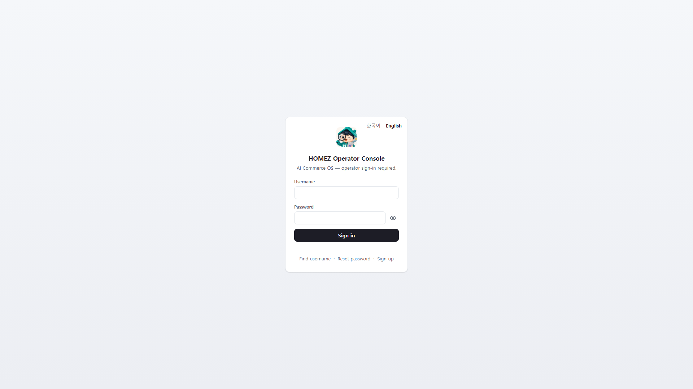
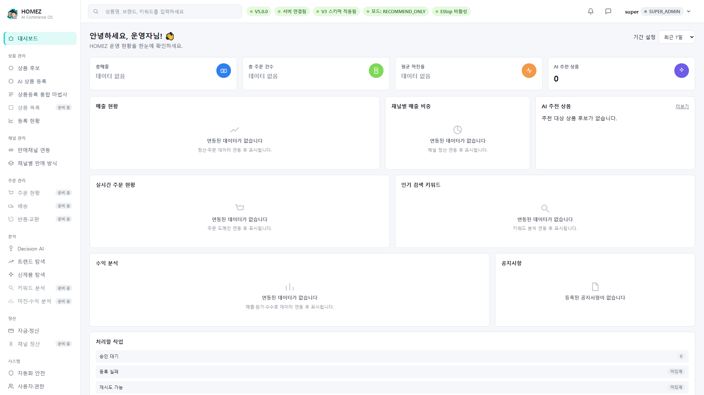
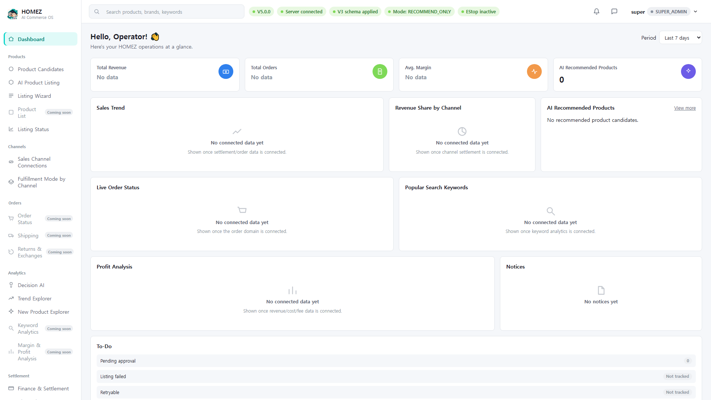
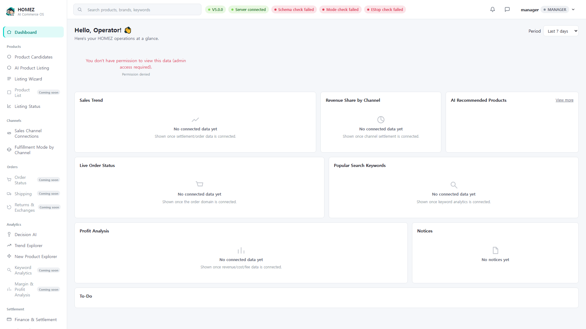
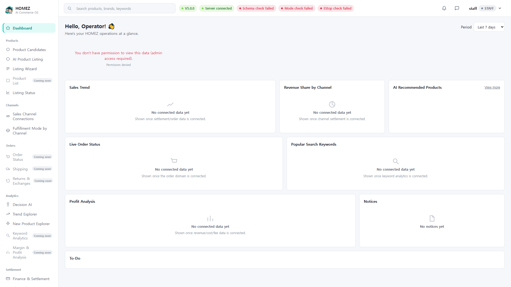
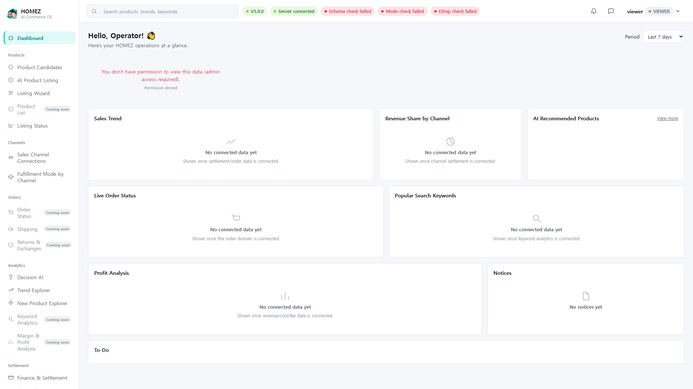

# HOMEZ V6.5 Quick Start Guide (English)

- Audience: any role opening the HOMEZ Operator Console for the first
  time (super_admin/admin, manager, staff, viewer)
- Target runtime: 3-5 minutes
- Version: HOMEZ V6.5
- Verification: checked against the real source
  (`app/web/console.html`, `console.js`, `app/core/auth.py`) and real
  screen captures taken against a temporary demo database (virtual
  company, virtual accounts). The real operational database
  (`homez.db`) was only read for hash verification and was never
  written to while producing this guide.

## In scope / out of scope

**Covered here**: reaching the login screen, signing in with a
username/password, switching the login-screen language (Korean ↔
English), the first dashboard screen after login, the left-hand
navigation structure at a glance, and how the dashboard differs by
role (super_admin/admin, manager, staff, viewer).

**Not covered here** (see other guides, or V7 scope):
- Admin initial setup (company info, invite codes, first admin
  registration) → Guide 2
- Full product-registration flow → Guide 3
- Mobile-specific usage → Guide 4
- Login failures, error codes, safe-usage rules → Guide 5
- Real Coupang/Naver API integration, real product submission, real
  payment/settlement — these appear in demo screens elsewhere in
  HOMEZ but are **all Fake Provider or dry-run in V6.5 and never
  actually sent externally.** See
  `docs/guides/FEATURE_LIMITATIONS.md` for the full list.

## 1. Opening the login screen

Launching HOMEZ Desktop always shows the login screen first.

Screen layout (from the real `console.html`):
- Top right: a language switch link `한국어 · English` — usable
  before signing in.
- Center: the HOMEZ logo, "HOMEZ 운영자 Console" title, and the
  subtitle "AI Commerce OS — 운영자 인증이 필요합니다." (operator
  authentication required)
- Fields: username, password (with a show/hide eye icon)
- A black "로그인" (Log in) button
- Footer links: Find ID · Reset password · Sign up

## 2. Switching language before login

Clicking `English` in the top-right corner instantly switches the
entire login screen to English.

The choice is persisted in browser storage
(`homez_console_locale`) and carries over into the authenticated
screens after login.

## 3. Signing in

Enter your username and password and press the login button. On
success you are taken straight to the dashboard.

> Note: login requires both a username and a matching password. A
> mismatch produces the on-screen error "Invalid username or
> password." exactly as returned by the server. The real error
> screen and how to respond to it are covered in
> [Guide 5. Troubleshooting & Safe Use](05_TROUBLESHOOTING_EN.md).

## 4. First screen after login — the dashboard

After login you land on a screen with the left navigation, a top bar
(search, notifications, user menu), and dashboard cards in the
center. (shown here as super_admin)

The same screen switched to English:

## 5. Left navigation structure (from the real source, 6 groups)

| Group | Menu item | Status |
|---|---|---|
| (none) | Dashboard | Available |
| Product | Product Candidates | Available |
| Product | AI Product Listing | Available |
| Product | Listing Wizard | Available |
| Product | Product List | **Coming soon** |
| Product | Listing Status | Available |
| Channel | Store Connection | Available |
| Channel | Marketplace Listing Mode | Available |
| Orders | Order Status | **Coming soon** |
| Orders | Shipment | **Coming soon** |
| Orders | Returns & Exchanges | **Coming soon** |
| Analytics | Decision AI | Available |
| Analytics | Trend Explorer | Available |
| Analytics | New Product Explorer | Available |
| Analytics | Keyword Analysis | **Coming soon** |
| Analytics | Margin & Profit Analysis | **Coming soon** |
| Settlement | Finance | Available |
| Settlement | Channel Settlement | **Coming soon** |
| System | Automation Safety | Available |
| System | Users & Permissions / Settings · Account & Security | Available (both entries open the same settings screen) |
| System | System Status | Available |

Items marked "Coming soon" are genuinely inert — clicking them shows
a placeholder screen ("This screen is still coming soon") instead of
any real feature. This guide, and every other V6.5 guide, never
describes these as working features.

## 6. How the screen differs by role

HOMEZ supports four roles: super_admin/admin, manager, staff, and
viewer. Admin-only data (dashboard metrics, etc.) is correctly
blocked when signed in as manager/staff/viewer:

| Role | Screen |
|---|---|
| manager |  |
| staff |  |
| viewer |  |

All three roles show red "Schema check failed / Mode check failed /
EStop check failed" badges plus "You don't have permission to view
this data (admin access required)." This is not a bug — it is
**intentional permission enforcement**, confirmed identically on
desktop and on 430x932 mobile viewports.

## 7. Changing language after login

After login, language can only be switched **inside the Settings
screen**, not from the top bar. Open the "Settings · Account &
Security" menu item to find the Korean/English toggle.

## Feature include/exclude summary

**Real, implemented features covered by this guide**: login,
pre/post-login language switching, dashboard entry, verifying
role-based access control.

**Things shown here that are not real features yet**: none — the
Quick Start flow does not enter any Fake Provider/dry-run screens.

**Explicitly V7 and out of scope here**: real external API
integration, real payment processing.

## In-app help summary

See [apphelp/01_quick_start_help_ko.md](apphelp/01_quick_start_help_ko.md)
for the condensed in-app help text (Korean/English).
