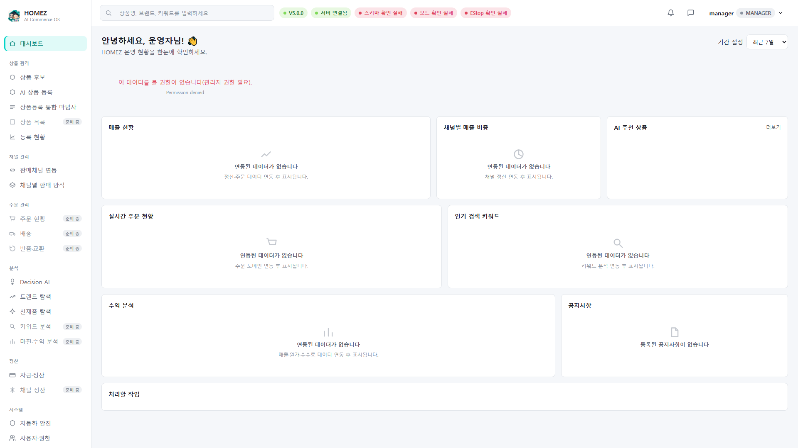
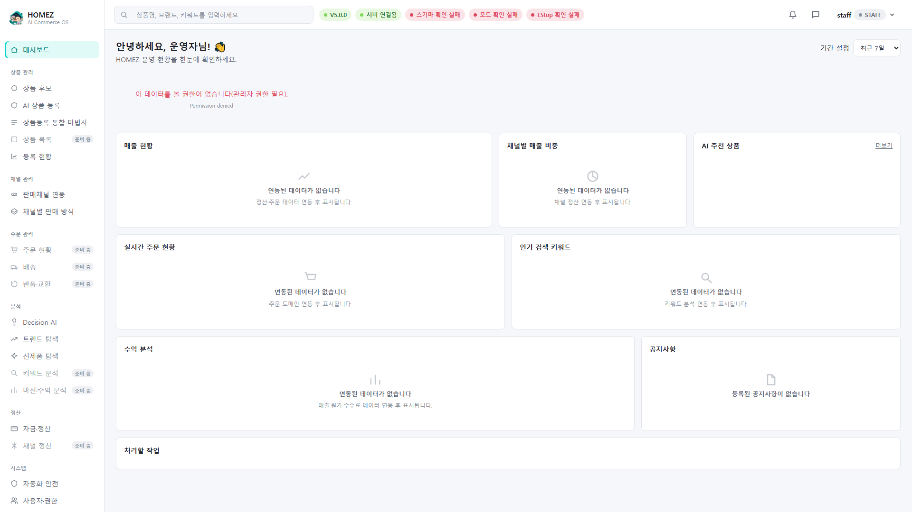

# HOMEZ V6.5 빠른 시작 가이드 (한국어)

- 대상: HOMEZ 운영자 Console을 처음 켜는 모든 역할(super_admin/admin,
  manager, staff, viewer)
- 목표 재생 시간: 3~5분
- 버전: HOMEZ V6.5
- 검증 상태: 실제 코드(`app/web/console.html`, `console.js`,
  `app/core/auth.py`)와 임시 데모 DB(가상 회사·가상 계정) 기준 실 화면
  캡처로 확인됨. 실제 운영 DB(`homez.db`)는 읽기 전용으로만 확인했고
  이 가이드 제작 과정에서 어떤 값도 쓰지 않았다.

## 이 가이드에서 다루는 것 / 다루지 않는 것

**다룬다**: 로그인 화면 진입, 아이디/비밀번호 로그인, 로그인 화면
언어 전환(한국어 ↔ English), 로그인 성공 후 대시보드 첫 화면, 좌측
메뉴 구조 한눈에 보기, 역할(super_admin/admin/manager/staff/viewer)에
따라 보이는 화면이 어떻게 달라지는지.

**다루지 않는다** (다른 가이드 또는 V7 범위):
- 관리자 초기 설정(회사 정보, 초대 코드, 최초 관리자 등록) → 가이드 2
- 상품 등록 전체 과정 → 가이드 3
- 모바일 화면 전용 조작법 → 가이드 4
- 로그인 실패·오류 코드·안전 사용 수칙 → 가이드 5
- 실제 쿠팡/네이버 API 연동, 실제 상품 등록, 실제 결제/정산 — 이
  가이드의 데모 화면에는 등장하지만 **모두 Fake Provider 또는
  dry-run이며 V6.5에서 실제로 외부에 전송되지 않는다.** 자세한 내용은
  `docs/guides/FEATURE_LIMITATIONS.md` 참고.

## 1. 로그인 화면 열기

HOMEZ Desktop을 실행하면 가장 먼저 로그인 화면이 나타난다.

화면 구성(실제 `console.html` 기준):
- 우측 상단: 언어 전환 링크 `한국어 · English` — 로그인 전에도 바로
  전환 가능하다.
- 중앙: HOMEZ 로고, "HOMEZ 운영자 Console" 제목, "AI Commerce OS —
  운영자 인증이 필요합니다." 안내문
- 입력 필드: 아이디, 비밀번호(우측 눈 아이콘으로 표시/숨김 전환)
- 검은색 "로그인" 버튼
- 하단 링크: 아이디 찾기 · 비밀번호 재설정 · 회원가입

## 2. 언어 전환 (로그인 전)

우측 상단의 `English`를 누르면 로그인 화면 전체가 즉시 영어로
전환된다.

이 선택은 브라우저 저장소(`homez_console_locale`)에 저장되며, 이후
로그인 후 화면에도 그대로 이어진다.

## 3. 로그인

아이디와 비밀번호를 입력하고 "로그인" 버튼을 누른다. 성공하면 곧바로
대시보드로 이동한다.

> 참고: 로그인에는 사용자 이름(아이디)과 별도 비밀번호가 필요하며,
> 두 값이 일치하지 않으면 "아이디 또는 비밀번호가 올바르지 않습니다."
> 오류가 화면에 그대로 표시된다. 실제 오류 화면과 대응 방법은
> [가이드 5. 문제 해결과 안전 사용](05_TROUBLESHOOTING_KO.md)에서
> 다룬다.

## 4. 로그인 직후 첫 화면 — 대시보드

로그인이 끝나면 좌측에 메뉴, 상단에 검색·알림·사용자 메뉴, 중앙에
대시보드 카드가 있는 화면이 뜬다. (최고관리자 기준)

같은 화면을 영어로 전환하면 다음과 같다.

## 5. 좌측 메뉴 구조 (실제 코드 기준, 총 6개 그룹)

| 그룹 | 메뉴 항목 | 상태 |
|---|---|---|
| (없음) | 대시보드 | 사용 가능 |
| 상품 관리 | 상품 후보 | 사용 가능 |
| 상품 관리 | AI 상품 등록 | 사용 가능 |
| 상품 관리 | 상품등록 통합 마법사 | 사용 가능 |
| 상품 관리 | 상품 목록 | **준비 중** |
| 상품 관리 | 등록 현황 | 사용 가능 |
| 채널 관리 | 판매채널 연동 | 사용 가능 |
| 채널 관리 | 채널별 판매 방식 | 사용 가능 |
| 주문 관리 | 주문 현황 | **준비 중** |
| 주문 관리 | 배송 | **준비 중** |
| 주문 관리 | 반품·교환 | **준비 중** |
| 분석 | Decision AI | 사용 가능 |
| 분석 | 트렌드 탐색 | 사용 가능 |
| 분석 | 신제품 탐색 | 사용 가능 |
| 분석 | 키워드 분석 | **준비 중** |
| 분석 | 마진·수익 분석 | **준비 중** |
| 정산 | 자금·정산 | 사용 가능 |
| 정산 | 채널 정산 | **준비 중** |
| 시스템 | 자동화 안전 | 사용 가능 |
| 시스템 | 사용자·권한 / 설정 · 계정 및 보안 | 사용 가능(두 항목 모두 같은 설정 화면으로 연결됨) |
| 시스템 | 시스템 상태 | 사용 가능 |

"준비 중" 배지가 붙은 메뉴는 클릭해도 실제 화면 대신 "아직 준비 중인
화면입니다" 안내만 나온다. 이 가이드를 포함한 모든 V6.5 가이드는
이 메뉴들을 완료된 기능처럼 설명하지 않는다.

## 6. 역할에 따라 달라지는 화면

HOMEZ는 super_admin/admin, manager, staff, viewer 네 가지 역할을
지원한다. 관리자 전용 데이터(대시보드 지표 등)는 manager/staff/viewer
로 로그인하면 다음과 같이 차단된 상태로 보인다.

| 역할 | 화면 |
|---|---|
| manager |  |
| staff |  |
| viewer |  |

세 역할 모두 "Schema check 확인 실패 / Mode check 확인 실패 / EStop
check 확인 실패" 빨간 배지와 "이 데이터를 볼 권한이 없습니다(관리자
권한 필요)"라는 안내가 실제로 뜬다 — 오류가 아니라 **의도된 권한
차단**이다. 데스크톱 화면과 430×932 모바일 화면에서 동일하게 확인됨.

## 7. 설정에서 언어 바꾸기 (로그인 후)

로그인 후에는 상단 메뉴가 아니라 **설정 화면 안에서만** 언어를 바꿀
수 있다. 좌측 "설정 · 계정 및 보안" 메뉴로 들어가면 한국어/English
전환 버튼이 있다.

## 포함 기능 / 제외 기능 요약

**이 가이드가 다루는 실제 구현 기능**: 로그인, 로그인 전/후 언어
전환, 대시보드 진입, 역할별 접근 제어 확인.

**이 가이드에 등장하지만 아직 실제 기능이 아닌 것**: 없음 — 빠른
시작 단계에서는 Fake Provider/dry-run 화면에 진입하지 않는다.

**V7 예정이라 여기서 다루지 않은 것**: 실제 외부 API 연동, 실제 결제.

## 앱 내부 도움말 요약 (요약본)

전체 요약은 [apphelp/01_quick_start_help_ko.md](apphelp/01_quick_start_help_ko.md)
참고.
