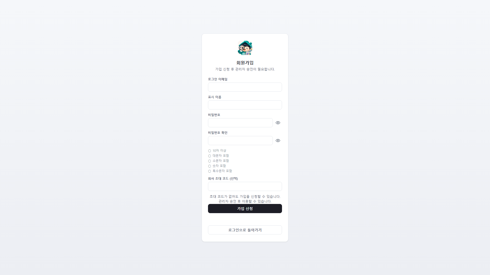
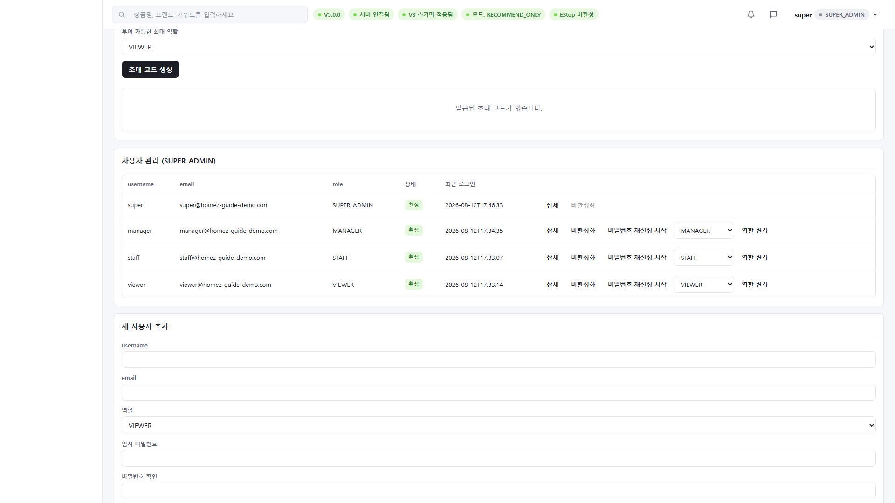
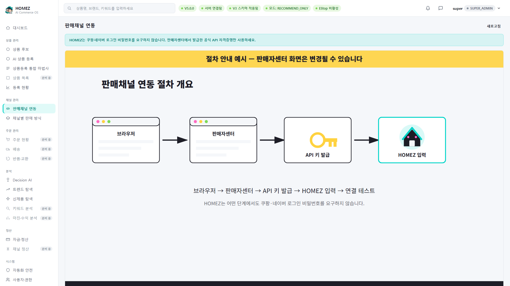
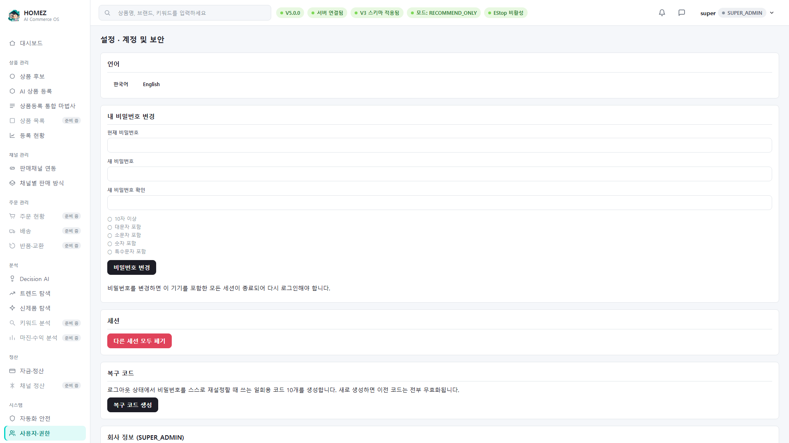

# HOMEZ V6.5 관리자 초기 설정 가이드 (한국어)

- 대상: 회사를 처음 등록하는 최고관리자(SUPER_ADMIN), 팀원을 초대하는
  관리자
- 목표 재생 시간: 5~8분
- 버전: HOMEZ V6.5
- 검증 상태: `app/web/console.html`의 `register-gate`/`setup-gate`/
  `company-recovery-gate`/`view-account-security` 실제 마크업과, 임시
  데모 DB(가상 회사 `HOMEZ Guide Demo Co.`, 가상 계정
  `manager@homez-guide-demo.com` 등)를 대상으로 한 실 화면 캡처로 확인.

## 이 가이드에서 다루는 것 / 다루지 않는 것

**다룬다**: 회원가입(가입 신청) 화면, 최초 관리자 설정 화면의 실제
입력 필드 구조, 초대 코드 발급, 가입 승인 대기열, 사용자 관리(역할
변경/비활성화/비밀번호 재설정 시작), 새 사용자 추가, 비밀번호 변경,
세션 폐기, 복구 코드 생성, 판매채널 연동(쿠팡/네이버) 화면 진입.

**다루지 않는다**:
- 실제 쿠팡/네이버 계정으로 연동 완료 → 이 화면은 Credential 입력
  UI까지만 보여주며, 실제 저장은 이 가이드 제작 과정에서 수행하지
  않았다. (자세한 경계는 `FEATURE_LIMITATIONS.md`)
- 상품 등록 자체 → 가이드 3
- 문제 해결 → 가이드 5

## 1. 새 팀원 가입 신청 (회원가입)

로그인 화면에서 "회원가입"을 누르면 아래 화면으로 이동한다.

실제 필드(코드 기준): 로그인 이메일, 표시 이름, 비밀번호(+확인),
비밀번호 정책 체크리스트(10자 이상/대문자/소문자/숫자/특수문자
포함), 회사 초대 코드(선택). **초대 코드 없이도 가입 신청 자체는
가능하지만, 화면 안내처럼 관리자 승인 전에는 이용할 수 없다.**

## 2. 관리자 쪽에서 가입 승인하기

관리자가 로그인 후 "설정 · 계정 및 보안" 화면으로 들어가면 "가입 승인
대기" 패널에서 신청 목록을 확인하고 승인/거절할 수 있다. (이 패널은
신청이 있을 때만 채워지며, 이 가이드의 데모 환경에는 사전 승인된
계정만 시딩되어 있어 목록이 비어 있는 상태로 캡처되었다 — 실제
UI 구조는 코드로 확인됨.)

## 3. 초대 코드 발급

같은 "설정" 화면의 "초대 코드" 패널에서, 부여 가능한 최대 역할
(VIEWER/STAFF/MANAGER/ADMIN/SUPER_ADMIN)을 정하고 "초대 코드 생성"을
누르면 새 초대 코드가 발급된다.

> 보안 참고: 발급된 초대 코드는 실제 값이 화면에 그대로 노출되므로,
> 영상 녹화 시 이 부분은 반드시 모자이크 처리한다(공통 영상 제작
> 규칙 — 초대 코드/복구 코드/토큰 절대 노출 금지).

## 4. 사용자 관리 (SUPER_ADMIN 전용)

같은 화면 하단에 회사 소속 사용자 전체 목록이 실제 표로 나타난다:
아이디, 이메일, 역할, 상태(활성/비활성), 최근 로그인, 그리고 각 행에
"상세 / 비활성화 / 비밀번호 재설정 시작 / 역할 변경" 조작이 있다.
바로 아래 "새 사용자 추가" 폼으로 아이디·이메일·역할·임시 비밀번호를
입력해 계정을 직접 만들 수도 있다.

## 5. 판매채널 연동 화면 진입

좌측 메뉴 "판매채널 연동"으로 들어가면 쿠팡/네이버 연동 절차 안내와
Credential 입력 마법사가 나온다.

화면에 노란 배너로 "절차 안내 예시 — 판매자센터 화면은 변경될 수
있습니다"라고 명시되어 있다 — 이 화면의 절차 설명은 참고용 안내이지
쿠팡/네이버가 보증하는 화면이 아니다. **이 가이드에서는 실제 Access
Key/Secret Key를 입력하지 않는다.**

## 6. 계정 및 보안 설정 한눈에 보기

"설정 · 계정 및 보안" 화면에는 언어 전환, 내 비밀번호 변경, 세션
관리(다른 세션 모두 폐기), 복구 코드 생성(로그아웃 상태에서 자가
비밀번호 재설정용 일회용 코드 10개, 재생성 시 이전 코드 전부 무효화)
가 모두 한 화면에 있다.

> 보안 참고: 복구 코드는 생성 직후 딱 한 번만 화면에 표시된다. 영상
> 녹화 중 실제 코드가 노출되지 않도록 반드시 데모 전용 계정에서만
> 시연하고, 녹화본에서 코드 영역을 모자이크한다.

## 포함 기능 / 제외 기능 요약

**실제 구현되어 이 가이드가 다루는 기능**: 가입 신청, 가입 승인
대기열 UI, 초대 코드 발급, 사용자 목록/역할 변경/비활성화/비밀번호
재설정 시작, 새 사용자 추가, 비밀번호 변경, 세션 폐기, 복구 코드
생성, 판매채널 연동 화면 진입.

**화면에는 있지만 이 가이드에서 실제로 실행하지 않은 것**: 실제
쿠팡/네이버 Access Key 저장 및 검증(민감정보이므로 시연하지 않음).

**V7 예정이라 다루지 않는 것**: 실제 외부 판매자센터 API 승인/실
연동 완료.

## 앱 내부 도움말 요약

[apphelp/02_admin_setup_help_ko.md](apphelp/02_admin_setup_help_ko.md)
참고.
