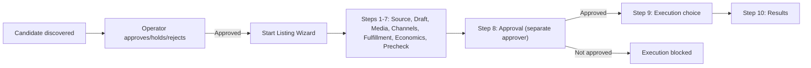
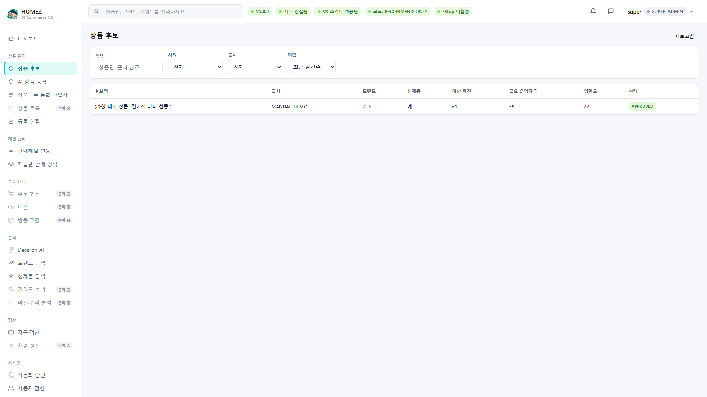
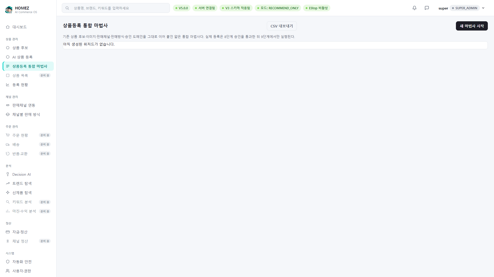
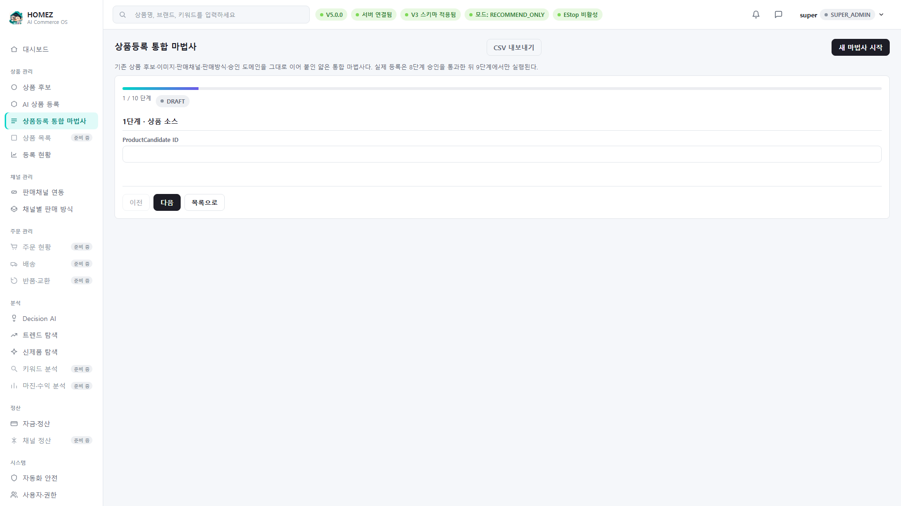
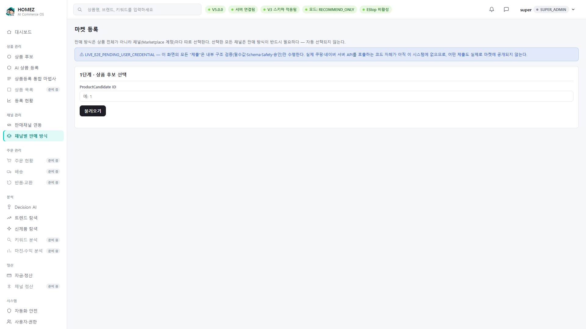

# HOMEZ V6.5 Full Product Registration Guide (English)

- Audience: admins/managers taking a product from candidate approval
  through the Listing Wizard
- Target runtime: 10-15 minutes
- Version: HOMEZ V6.5
- Verification: checked against
  `app/domains/marketplace_listing/listing_wizard_*.py`, the real
  `lw.step.*` catalog in `app/web/i18n/ko-KR.js`, and real screen
  captures against one virtual product candidate inserted into the
  temp demo database (`(Virtual demo product) Foldable Mini Fan`,
  status APPROVED).

## In scope / out of scope

**Covered here**: the Product Candidates screen structure, the
Listing Wizard's real 10-step structure, the real screen for wizard
step 1 (Product Source), the LIVE_E2E warning banner on the
"Marketplace Listing Mode" screen, and code-backed explanation of
exactly when real submission executes (step 8 approval → step 9
execution).

**Not covered here**:
- Actually completing wizard steps 2-10 end to end — this guide
  stopped at step 1 to avoid triggering a real submission. Steps 2-10
  are described from the real step names in
  `app/web/i18n/ko-KR.js` and the `listing_wizard_*.py` source, not
  from screen captures — this is called out explicitly.
- Real Coupang/Naver submission — in V6.5 this path is
  `LIVE_E2E_PENDING_USER_CREDENTIAL`; no real send code exists yet.
- AI image generation — Fake Provider only (see Guide 5).

## 1. The flow at a glance

This mirrors the real gate structure in
`listing_wizard_approval.py`/`listing_wizard_submission.py` — step 9
execution only unlocks after step 8 approval, exactly as the screen
itself states: "actual registration only executes at step 9, after
step 8 approval."

## 2. Product Candidates screen

The left "Product Candidates" menu shows a table of discovered
candidates with trend score, new-product flag, expected margin,
required funding, risk score, and status. For this guide a single
virtual product was inserted directly into the temp database to show
the real table with a row in it.

> "(Virtual demo product) Foldable Mini Fan" shown here is not a real
> collected/analyzed result — it was inserted directly into the temp
> database to produce this guide. In a real environment this table is
> populated by the Trend Explorer / New Product Explorer domains.

## 3. Listing Wizard — overview screen

Opening the wizard menu shows "no wizards created yet" and a "Start
new wizard" button.

## 4. Wizard step 1 — Product Source

Pressing "Start new wizard" shows the real screen: a progress bar
(1/10 steps), a DRAFT status badge, the title "Step 1 · Product
Source," a field for the approved ProductCandidate's ID, and
Previous/Next/Back to list buttons.

## 5. Wizard steps 2-10 (from source code — not screen captures)

Exactly as defined in the real i18n catalog
(`app/web/i18n/ko-KR.js`):

| Step | Name |
|---|---|
| 2 | Product Draft |
| 3 | Media |
| 4 | Channels |
| 5 | Fulfillment mode |
| 6 | Pricing & Margin |
| 7 | Precheck |
| 8 | Approval |
| 9 | Execution choice |
| 10 | Results |

Step 6 "Pricing & Margin" uses a Decimal-based margin calculator (in
`listing_wizard_service.py`). Step 7 "Precheck" runs a structured
precheck engine that catches missing required fields and policy
violations before submission. Step 8 "Approval" requires a separate
approver (not the requester) to approve, and pins the
listing/selection state at approval time via a SHA-256 fingerprint —
if anything changes afterward, the approval is automatically
invalidated (the same pattern used in the `marketplace_listing`
domain). Real submission only executes at step 9 "Execution choice";
step 10 "Results" shows per-channel success/partial-success/failure
outcomes.

## 6. Marketplace Listing Mode screen

The "Marketplace Listing Mode" menu lets you choose a per-channel
fulfillment mode (e.g., Coupang Seller-Fulfilled / Rocket Growth,
Naver Seller-Fulfilled).

The screen carries an explicit `LIVE_E2E_PENDING_USER_CREDENTIAL`
banner — no code exists yet in V6.5 that actually sends data to
Coupang/Naver through this path.

## 7. Automatic Channel Policy Check · Product Selection Summary · AI Result Types (V7 new, 2026-08-21)

This section is not based on screenshots but on real API responses and
UI rendering confirmed this session via an isolated temporary
database and a live browser session (following the same "code +
verified evidence" principle as sections 1-6 above).

### Automatic channel policy check

Once you select a channel at step 5 (Fulfillment), a "Channel Policy
Check" panel is automatically attached to that channel's block. The
"Check now" button evaluates real policy rules (currently only
Coupang official-document-backed rules are active) and shows a
badge: **Eligible** (pass) / **Eligible with actions** (evidence
needed) / **Data required** (missing structured values) / **Blocked**
(absolutely prohibited category) / **Policy changed** (needs
recheck). Each violated rule links to its official source (e.g.,
Coupang Marketplace's "Prohibited Items Guide").

**Important**: this screen's check is advisory. Actual submission is
independently re-verified by the server right before submission, and
ignoring this on-screen guidance from the frontend does not bypass
the server-side gate.

### Product selection summary

The product candidate detail screen has a "Product Selection Summary"
panel — nine items from channel policy through final user approval,
all on one screen: channel policy, legal/certification/safety,
resale rights, image rights, supplier & sourcing evidence,
inventory/MOQ/lead time, shipping & return feasibility, estimated
profitability & risk, and final user approval. Each item shows one
of: pass / needs improvement / data required / blocked / outdated.
**Policy blocking and profitability shortfalls are independent
criteria** — even when policy blocks a product, the profitability
calculation is still shown separately (the two are never merged into
one signal). "Resale rights" always shows "data required" in this
version since no corresponding feature exists yet (never guessed).

### AI result type distinction

Every automated judgment feature in HOMEZ reports one of 7 result
types only — so nothing gives the impression that "the AI decided":
confirmed data / calculated result / AI estimate / evidence required /
human review required / policy blocked / execution approval required.
Actual execution (product submission, price changes, purchase orders,
refunds, settlement finalization) is always decided separately by the
server's policy/permission/Emergency Stop/approval process, regardless
of this result value — no AI or rule-based feature approves its own
execution.

## Feature include/exclude summary

**Real, implemented features shown on screen**: the product
candidates list, the wizard overview screen, wizard step 1
(ProductCandidate ID entry), and the marketplace listing mode screen
with its warning banner.

**Confirmed from source but not screen-captured**: the actual input
screens for wizard steps 2-10 (not exercised here to avoid triggering
a real registration).

**Explicitly V7 and out of scope**: a completed real Coupang/Naver
submission, real AI image generation.

## In-app help summary

See [apphelp/03_product_registration_help_ko.md](apphelp/03_product_registration_help_ko.md).
