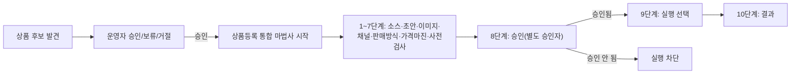

# HOMEZ V6.5 상품 등록 전체 과정 가이드 (한국어)

- 대상: 상품 후보 승인부터 상품등록 통합 마법사까지 다루는 관리자/매니저
- 목표 재생 시간: 10~15분
- 버전: HOMEZ V6.5
- 검증 상태: `app/domains/marketplace_listing/listing_wizard_*.py`,
  `app/web/i18n/ko-KR.js`의 `lw.step.*` 실제 카탈로그, 임시 데모 DB에
  삽입한 가상 상품 후보 1건(`(가상 데모 상품) 접이식 미니 선풍기`,
  상태 APPROVED)을 대상으로 한 실 화면 캡처로 확인.

## 이 가이드에서 다루는 것 / 다루지 않는 것

**다룬다**: 상품 후보 화면 구조, 상품등록 통합 마법사의 실제 10단계
구조, 마법사 1단계(상품 소스) 실제 화면, "채널별 판매 방식" 화면의
LIVE_E2E 경고 배너, 실제 등록이 실행되는 시점(8단계 승인 → 9단계
실행)에 대한 코드 근거 설명.

**다루지 않는다**:
- 마법사 2~10단계를 실제로 끝까지 입력해 완료하는 것 — 이 가이드
  제작 과정에서는 실제 등록을 유발하지 않기 위해 1단계까지만 진행했다.
  2~10단계 설명은 `app/web/i18n/ko-KR.js`의 실제 단계 이름과
  `listing_wizard_*.py` 코드 근거로만 기술하며, 화면 캡처가 아님을
  명시한다.
- 실제 쿠팡/네이버 제출 — V6.5에서 이 경로는 `LIVE_E2E_PENDING_USER_
  CREDENTIAL` 상태이며 실제 코드가 없다.
- AI 이미지 생성 — Fake Provider 전용(가이드 5 참고).

## 1. 전체 흐름 한눈에 보기

이 다이어그램은 `listing_wizard_approval.py`/`listing_wizard_submission.py`
의 실제 게이트 구조(8단계 승인을 통과해야만 9단계 실행이 열림)를
그대로 반영한다 — 화면에서도 "실제 등록은 8단계 승인을 통과한 뒤
9단계에서만 실행된다"고 명시되어 있다.

## 2. 상품 후보 화면

좌측 "상품 후보" 메뉴에는 발견된 후보의 트렌드/신제품 여부/예상
마진/필요 운영자금/위험도/상태가 표로 나타난다. 이 가이드에서는 임시
데모 DB에 가상 상품 1건을 직접 추가해 실제 표 형태를 보여준다.

> 이 표에 보이는 "(가상 데모 상품) 접이식 미니 선풍기"는 실제 수집·
> 분석 결과가 아니라 이 가이드 제작을 위해 임시 DB에 직접 넣은 가상
> 데이터다. 실제 운영 환경에서는 트렌드 탐색/신제품 탐색 도메인이
> 채워준다.

## 3. 상품등록 통합 마법사 — 개요 화면

마법사 메뉴로 들어가면 아직 생성된 위저드가 없다는 안내와 "새 마법사
시작" 버튼이 보인다.

## 4. 마법사 1단계 — 상품 소스

"새 마법사 시작"을 누르면 실제로 아래 화면이 뜬다: 진행률 표시줄
(1/10 단계), 상태 배지(DRAFT), "1단계 · 상품 소스" 제목, 승인된
ProductCandidate의 ID를 입력하는 필드, 이전/다음/목록으로 버튼.

## 5. 마법사 2~10단계 (코드 기준 설명 — 화면 캡처 아님)

실제 다국어 카탈로그(`app/web/i18n/ko-KR.js`)에 정의된 단계 이름
그대로:

| 단계 | 이름 |
|---|---|
| 2 | 상품 초안 |
| 3 | 이미지 |
| 4 | 판매채널 |
| 5 | 판매 방식 |
| 6 | 가격·마진 |
| 7 | 사전검사 |
| 8 | 승인 |
| 9 | 실행 선택 |
| 10 | 결과 |

6단계 "가격·마진"은 Decimal 기반 마진 계산기(`listing_wizard_service.py`
내 계산 로직)를 사용한다. 7단계 "사전검사"는 구조화된 사전검사
엔진이 필수 필드 누락·정책 위반 등을 미리 걸러낸다. 8단계 "승인"은
요청자 본인이 아닌 별도 승인자가 승인해야 하며, 승인 시점의
listing/selection 상태를 SHA-256 fingerprint로 고정해 승인 이후 값이
바뀌면 자동으로 무효화된다(`marketplace_listing` 도메인과 동일한
승인 패턴). 9단계 "실행 선택"에서만 실제 제출이 실행되며, 10단계
"결과"에서 채널별 성공/부분성공/실패 결과를 확인한다.

## 6. 채널별 판매 방식 화면

"채널별 판매 방식" 메뉴는 채널마다 다른 판매 방식(예: 쿠팡 판매자
배송/로켓그로스, 네이버 판매자 배송)을 선택하는 화면이다.

화면에 `LIVE_E2E_PENDING_USER_CREDENTIAL` 배너가 명시되어 있다 — 이
경로로 실제 쿠팡/네이버에 데이터가 전송되는 코드는 V6.5에 아직 없다.

## 7. 채널 정책 자동 검사 · 상품 선별 요약 · AI 결과 유형 (V7 신규, 2026-08-21)

이 절은 스크린샷이 아니라 이번 세션에 격리(isolated) 임시 DB +
실제 브라우저 라이브 검증으로 확인한 실제 API 응답·화면 렌더링
결과를 코드 근거와 함께 기술한다(V6.5까지의 위 1~6절과 동일한
"코드+실측 근거" 원칙을 따른다).

### 판매채널 정책 자동 검사

5단계(판매 방식)에서 채널을 선택하면 그 채널 블록 안에 "채널 정책
검사" 패널이 자동으로 붙는다 — "지금 검사" 버튼을 누르면 실제 정책
규칙(현재는 쿠팡 공식 문서 기반 규칙만 활성)을 평가해 배지로
보여준다: **등록 가능**(통과) / **보완 후 등록 가능**(증빙 필요) /
**정보 입력 필요**(구조화 값 누락) / **등록 불가**(절대 판매 금지
카테고리) / **정책 변경됨**(재검사 필요). 위반 항목마다 공식 근거
링크(예: 쿠팡 마켓플레이스 "판매 불가 품목 안내")가 함께 표시된다.

**중요**: 이 화면의 검사는 안내용이다. 실제 제출은 이 화면과 별개로
서버가 제출 직전에 다시 강제로 재확인하며, 프런트엔드에서 이 안내를
무시하고 진행해도 서버 게이트가 우회되지 않는다.

### 상품 선별 요약

상품 후보 상세 화면에 "상품 선별 요약" 패널이 있다 — 판매채널
정책부터 사용자 최종 승인까지 9개 항목을 한 화면에서 확인한다:
판매채널 정책, 법률·인증·안전, 재판매 권리, 이미지 권리, 공급처와
공급 증빙, 재고·MOQ·리드타임, 배송·반품 가능성, 예상 수익성과 위험,
사용자 최종 승인. 각 항목은 통과/보완 필요/자료 필요/차단/오래된
정보 중 하나로 표시된다. **정책 차단과 예상 수익성 미달은 서로 다른
기준이다** — 정책이 막혀도 수익성 계산 자체는 별도로 계속 보여준다
(둘을 섞어서 보여주지 않는다). "재판매 권리" 항목은 이 버전에
대응하는 기능이 아직 없어 항상 "자료 필요"로 표시된다(추정하지
않음).

### AI 결과 유형 구분

HOMEZ의 모든 자동 판단 기능은 다음 7종 결과 중 하나로만 표시된다 —
"AI가 확정했다"는 인상을 주지 않기 위해서다: 확인된 데이터 /
계산된 결과 / AI 추정치 / 증빙 필요 / 사람 검토 필요 / 정책 차단 /
실행 승인 필요. 실제 실행(상품 제출·가격 변경·발주·환불·정산
확정)은 이 결과값과 무관하게 항상 별도의 서버 정책·권한·Emergency
Stop·승인 절차가 최종 결정한다 — 어떤 AI/규칙 기반 기능도 스스로
실행을 승인하지 않는다.

## 포함 기능 / 제외 기능 요약

**실제 구현되어 화면으로 확인된 기능**: 상품 후보 목록, 마법사 개요
화면, 마법사 1단계(ProductCandidate ID 입력), 채널별 판매 방식 화면과
그 경고 배너.

**코드로만 확인하고 화면 캡처는 하지 않은 것**: 마법사 2~10단계의
실제 입력 화면(실제 등록을 유발하지 않기 위해 이 가이드에서는
진행하지 않음).

**V7 예정이라 다루지 않은 것**: 실제 쿠팡/네이버 제출 완료, 실제
이미지 생성 API.

## 앱 내부 도움말 요약

[apphelp/03_product_registration_help_ko.md](apphelp/03_product_registration_help_ko.md)
참고.
