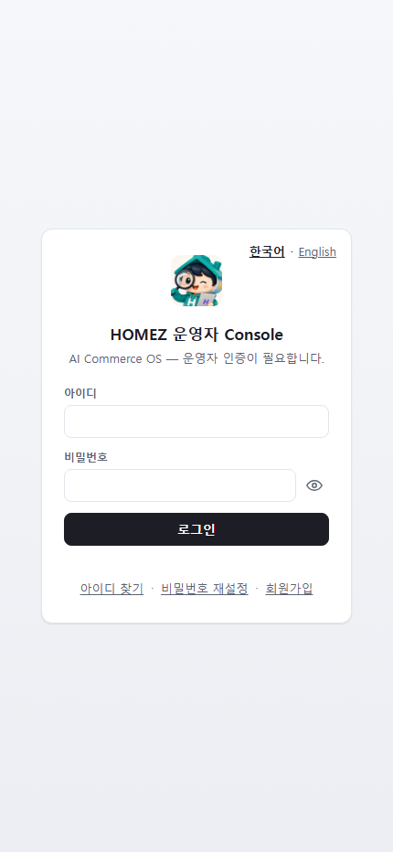
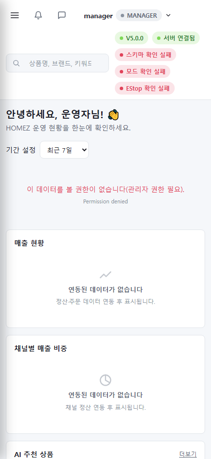
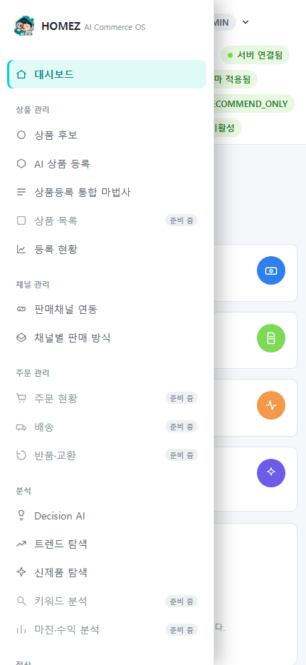
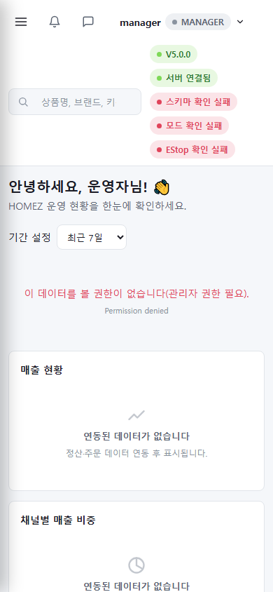
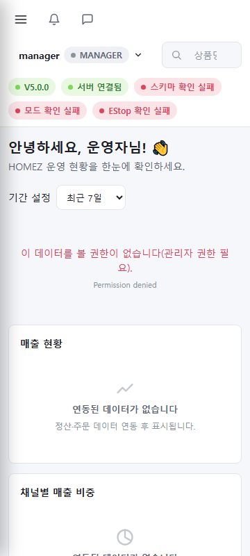
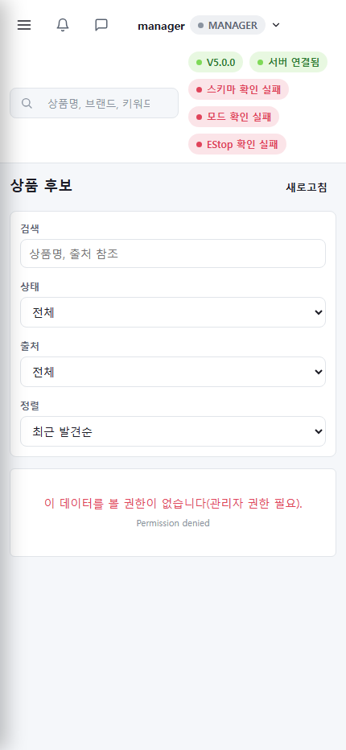

# HOMEZ V6.5 Mobile Usage Guide (English)

- Audience: anyone checking the HOMEZ Console on a phone or small
  screen, any role
- Target runtime: 5-8 minutes
- Version: HOMEZ V6.5
- Verification: real responsive CSS and the `#mobile-nav-toggle`
  button behavior captured at three real viewports (430x932, 390x844,
  360x800), using the Manager role.

## In scope / out of scope

**Covered here**: logging in on a mobile screen, how the top bar
rearranges on a narrow screen, opening the left menu via the
hamburger icon, layout differences across screen sizes, and that
permission enforcement is identical to desktop even on mobile.

**Not covered here**: HOMEZ has no separate native mobile app — this
guide covers only the **responsive browser layout**. There are no
mobile-only features (e.g., push notifications).

## 1. Mobile login screen

Even at 430x932, the login screen keeps the same card layout as
desktop, just narrower.

## 2. After login — the top bar narrows

After login, on a narrow screen the left menu is hidden by default
and a hamburger icon (☰) appears at the top-left of the top bar
instead. The search field and status badges remain but wrap onto
their own lines.

## 3. Opening the menu via the hamburger icon

Tapping the ☰ icon in the top bar slides in the same full left menu
used on desktop (same six groups, same "Coming soon" badges).

## 4. Comparing screen sizes

The same account and dashboard were checked at three real viewports.

| Viewport | Screen |
|---|---|
| 430x932 |  |
| 390x844 |  |
| 360x800 |  |

All three keep a single-column, stacked-card layout with no clipped
or overlapping elements.

## 5. Permission enforcement is identical on mobile

Opening Product Candidates on mobile as Manager shows the same "You
don't have permission to view this data (admin access required)"
message seen on desktop — proof that the server-side permission check
is unaffected by screen size.

## Feature include/exclude summary

**Real, implemented features covered here**: responsive mobile login,
the hamburger menu, layout across three viewports, and identical
permission enforcement on mobile.

**Does not exist**: a native mobile app, push notifications, or any
mobile-only shortcuts.

## In-app help summary

See [apphelp/04_mobile_usage_help_ko.md](apphelp/04_mobile_usage_help_ko.md).
