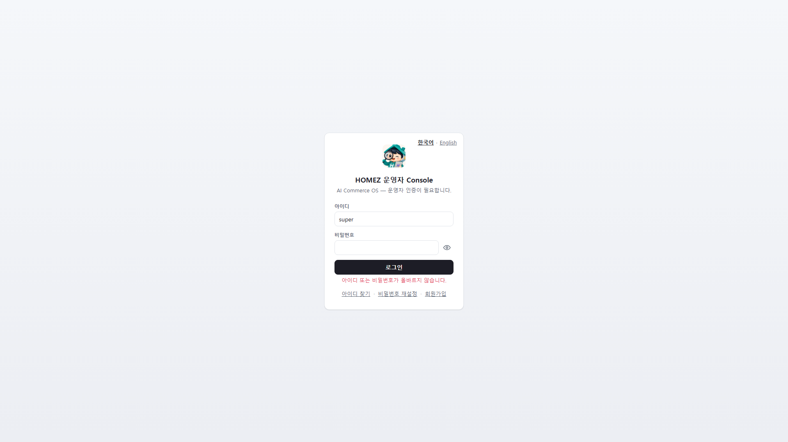

# HOMEZ V6.5 Troubleshooting & Safe Use Guide (English)

- Audience: all roles
- Target runtime: 5-8 minutes
- Version: HOMEZ V6.5
- Verification: checked against `app/core/auth.py`, the restricted
  mode middleware in `app/main.py`,
  `app/domains/diagnostics/router.py`, and a real reproduced
  login-failure screen capture (including a real bug hit and fixed
  during this guide's production, where a stale
  `homez_console_token` session caused the authenticated dashboard to
  render instead of the login screen).

## In scope / out of scope

**Covered here**: real error screens and what they mean, exactly why
the top status badges turn red, safe-usage rules, and the diagnostics
export API that helps when contacting support (currently API-only, no
UI button).

**Not covered here**: a real incident-response manual (that lives in
separate operations docs), or the detailed backup/restore command
sequence (see `docs/PACKAGING_CHECKLIST.md` for operators).

## 1. Login errors

A wrong username or password makes the server return 401, and the
screen shows exactly this:

The real error text is "Invalid username or password." — it never
reveals which field was wrong (a deliberate design choice so an
attacker can't probe for valid usernames).

## 2. When the top status badges turn red

The dashboard top bar shows five badges: V5.0.0 / Server connected /
Schema applied / Mode / EStop. **Signing in as a non-admin role
(manager/staff/viewer) turns three of them — schema, mode, EStop —
red with "check failed."** This is not a system outage; it happens
because that role lacks permission to query that status. Signing in
as an admin shows all of them green.

## 3. "You don't have permission to view this data"

Opening an admin-only screen (dashboard metrics, product candidates,
etc.) as manager/staff/viewer shows this message. The fix is either
signing in as an admin, or asking an admin to grant the needed
permission (see Guide 2's "User management" section).

## 4. Real error-code table

| Situation | HTTP status | Code/message | Meaning / fix |
|---|---|---|---|
| Login failure | 401 | "Invalid username or password." | Recheck username/password |
| Inactive account | 401 | "Inactive user" | Ask an admin to reactivate the account |
| Insufficient permission | 403 | "Insufficient privileges" / "Permission denied" | Admin access required — see Guide 2 |
| Migration restricted mode | 423 | `MIGRATION_RESTRICTED_MODE` | Writes are globally blocked while a migration is pending approval; an admin must approve it to clear |
| Marketplace API rate limit | 429 | includes a Retry-After header | Retry after the indicated wait; the UI shows a countdown |

## 5. Safe-usage rules

- **Never capture or share invite codes, recovery codes, or API
  Access Keys.** Mask them even in screenshots or recordings sent to
  support.
- **Always remember when you're on a Fake Provider/dry-run screen.**
  The warning banners on "Marketplace Listing Mode" or "AI Product
  Listing" are not decoration — they reflect the actual code state.
- **"Coming soon" menu items are safe to click** — they never change
  any real data.
- **Only admins should approve migrations**, and a backup must
  precede any real migration (internal operations procedure).

## 6. Contacting support — diagnostics export

HOMEZ has a `GET /diagnostics/export` API that bundles app version,
OS info, DB integrity status, migration status, registered route
count, and the log tail (with secrets stripped). **There is currently
no screen button for this API in V6.5** — someone with admin access
must call it directly, and attaching its output speeds up support
diagnosis.

## Feature include/exclude summary

**Real, implemented features covered here**: the login error screen,
the exact meaning of the permission badges/messages, migration
restricted mode (423), marketplace API rate limiting (429), and the
diagnostics export API.

**Does not exist**: a UI button for diagnostics export (API only).

## In-app help summary

See [apphelp/05_troubleshooting_help_ko.md](apphelp/05_troubleshooting_help_ko.md).
